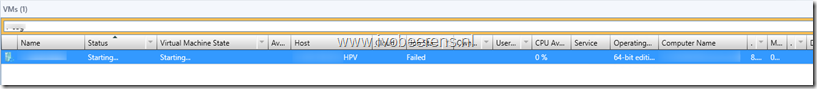

During a migration of a VM from a different cluster the job failed in SCVMM.

[](images/image.png)

The status of the VM in SCVMM Virtual Machine State is still “Starting”.

[](images/image2.png)

In SCVMM I was unable to stop, repair or delete the VM. When looking on the Hyper-V host, the VM didn’t exist in Failover Cluster Manager or Hyper-V manager. After some troubleshooting I was able to use the following PowerShell command to remove the orphaned VM in SCVMM:

```powershell
Import-Module VirtualMachineManager
Get-VM -VMMServer <VMMSERVER> –Name <VMNAME> | Remove-VM -Force
```

Replace the <VMMSERVER> and <VMName> in the PowerShell syntax with your own names