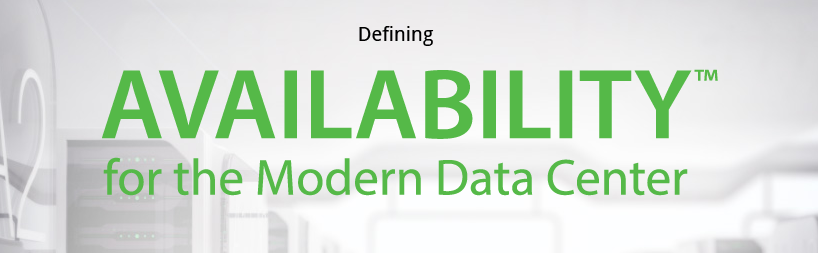

The new version of Veeam is called "Veeam Availability Suite v8".

The Veeam Availability Suite v8 has improvements in the following areas:

- **High Speed Recovery**
- **Data Loss Avoidance**
- **Verified Protection**
- **Leverage Data**
- **Complete Visibility**

**HIGH-SPEED RECOVERY**

Enables low recovery time objectives (RTOs) of <15 minutes; enables rapid recovery of the data customers want, in the form that they want it. Features are:

- Instant VM Recovery
- Instant File-Level Recovery
- **NEW v8** Veeam Explorer™ for Microsoft Exchange, SharePoint, SQL
- Server,Active Directory
- **NEW v8** Veeam Explorer for Storage Snapshots (HP and NetApp)

**DATA LOSS AVOIDANCE**

Avoids data loss by enabling low recovery point objectives (RPOs) of < 15 minutes and facilitating offsite data protection. New features v8 are:

- 2-in-1: backup and replication
- Built-in WAN Acceleration
- Native tape support
- **NEW v8** Backup from Storage Snapshots (HP and NetApp)
- **NEW v8** EMC Data Domain Boost
- **NEW v8** Veeam Cloud Connect
- **NEW v8** End-to-end encryption
- **NEW v8** Replication enhancements

**VERIFIED PROTECTION**

Reliably restores files, applications and virtual servers when needed; ensures business resiliency through automated backup and DR testing.

- SureBackup
- SureReplica

**LEVERAGE DATA**

Eliminates the risks associated with application deployment; allows you to test changes in a production‐like environment before actually deploying them.

- Virtual Lab

**COMPLETE VISIBILITY**

Provides monitoring and alerting tools so that you can discover and be alerted to issues in your IT environment before they have a significant impact.

- Complete visibility of the Veeam backup infrastructure
- vSphere Web Client Plug-in
- vCloud Director integration
- Centralized management

The Veeam Availability Suite v8 is scheduled for Q3 2014.