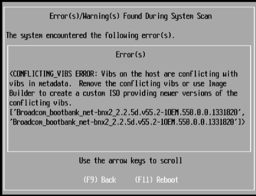

When upgrading from VMware vSphere 5.1 Update 2 to vSphere 5.5 Update 1 using the HP 5.5u1 ISO (VMware-ESXi-5.5.0-Update1-1746018-HP-5.74.27-Jun2014) the following error occurred:

> <CONFLICTING_VIBS ERROR:Vibs on the host are conflicting with vibs in metadata.Remove the conflicting VIBs or use Image Builder to create a custom ISO providing newer versions of the conflicting vibs. [‘Broadcom_bootbank_net-bnx2 – 2.2.5d.v55.2-1OEM.550.0.0.1331820,’Broadcom_bootbank_net-bnx2x_bnx2 – 2.2.5d.v55.2-1OEM.550.0.0.1331820]>

This issue occurs due to the version numbering of the Broadcom NX2 and Nx2x driver drivers within the HP Custom Image for ESXi 5.5 Update 1, which prevents the upgrade installation of these drivers in ESXi 5.5 Update 1.

To work around this issue use the **VMware-ESXi-5.5.0-Update1-1623387-HP-5.73.21-Mar2014.iso.** After the upgrade use VMware Update Manager to install the latest patches**.** Another work around is tocreate custom ISO with the "HP 5.5u1 ISO (VMware-ESXi-5.5.0-Update1-1746018-HP-5.74.27-Jun2014" using  ESXi Image Builder.

**More information about this issue can be found here:**

- VMware Community thread, [link](https://communities.VMware.com/thread/482105?start=0&tstart=0)
- VMware KB article, [link](http://kb.VMware.com/selfservice/microsites/search.do?language=en_US&cmd=displayKC&externalId=2082027)