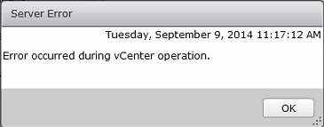
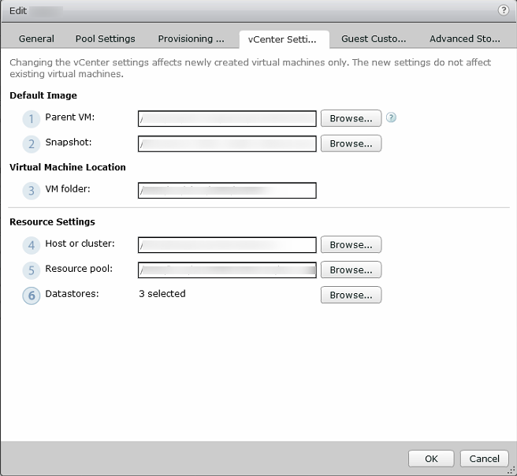

When editing a VMware Horizon desktop pool in some situations the server error 'Error occurred during vCenter operation'. appears.

The error hasn't any useful information that says what is wrong. When this error occurs the vCenter Server is unable to find one or more objects listed in the desktop pool. When changing datacenter, cluster or host settings in vCenter the desktop pool must be updated to.  To resolve this error open the desktop pool, select the vCenter settings tab an check or update the Parent VM, Snapshot, Host or cluster, Resource pool and datastores. Also check if the ESXi host with local storage are not in maintenance mode! After updating these settings the error must be gone.

