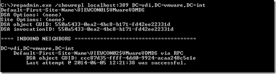
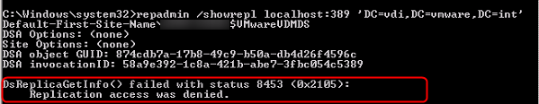
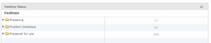
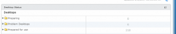
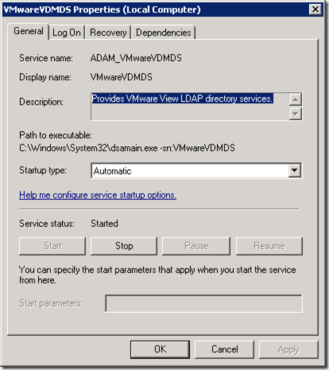
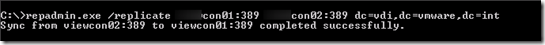

In environments with multiple Horizon View Connection Servers (High Available) the Lightweight Directory Access Protocol (LDAP) directory is replicated. Configuration, Pool and desktop information is stored in the ADAM database. Problems with replication can result in:
- Configuration changes made are not replicated
- Authentication problems

The VMware View Administrator dashboard does not check the replication status.  So regular checking the replication status is a good thing. Checking the replication status can be done by using the following command: 
```
repadmin.exe /showrepl localhost:389 DC=vdi,DC=VMware,DC=int
```
When the replication is okay, it looks like something below:

[](images/image11.png)

When there are problems with the replication between the  Connection Servers errors as "8453 Replication access was denied", "1772 The list of RPC servers available for the binding of auto handles has been exhausted" or 8457 The destination servers is currently rejecting replication requests" are displayed using the repadmin utility.

[](images/3.png)

When having replication problems, changes are not replicated. Here is an example when logging in the VMware View Administrator  on each View Connection server, it displays differences in the " Preparing"  " Problem Desktops"  and " Prepare for use" amounts.

<table style="height: 67px;" width="623"><tbody><tr><td><a href="images/4.png"></a></td><td><a href="https://www.ivobeerens.nl/wp-content/uploads/2014/06/5.png"></a></td></tr></tbody></table>

**Here are some tips for troubleshooting replication problems:**

- Check if port 389 is open on the View Connection Servers
- Restart the VMware View LDAP directory service (VMware VDMS service). It will restart the View Connection Server service.



- Force replication by using the following command: `repadmin.exe /replicate fqdn-localhost:389 fqdn-remotehost:389 dc=vdi,dc=VMware,dc=int`
- Change the fqdn-locahost and fqdn-remote host to the View Connection Server names in your environment

[](images/image6.png)

- Ensure that replication has not been disabled by using the following command:
`repadmin /options localhost:389 -DISABLE_OUTBOUND_REPL -DISABLE_INBOUND_REPL`

With the checks listed above the replication can be checked and in most cases repaired if it is broken.