A couple of weeks ago ControlUp released version 4.0 with support for VMware Horizon View. In this blog post I share my experience with ControlUp 4.0 monitoring VMware vSphere and VMware Horizon View.

**What is ControlUp**

ControlUp is a real-time performance monitor for Microsoft Remote Desktop Services (RDS), Citrix, and physical- and virtual server environments. ControlUp can be used to:

- Troubleshoot performance issues in real time
- Analyze performance trends and usage patterns
- Compare and manage multiple computers
- Investigate incidents and receive email alerts

The new 4.0 version of  ControlUp has added support for:

- VMware vSphere (4.x and 5.x)
- Citrix XenServer (6.x)
- VMware Horizon View desktops (5.x and 6.x)

ControlUp is tested against the following lab environment:

- VMware ESXi 5.5 Update 2
- VMware Horizon View 6.x environment with the composer
- The VDI desktops are part of a floating pool
- Windows 7 64-bit as VDI desktop OS.

**Installation and configuration**

The installation is very simple. On a management server execute a single executable (ControlUpConsole.exe).  It's runs in memory, so there is no installation needed. The console is the GUI for displaying data and running tasks. As prerequisites .Net Framework 3.5 SP1, Active Directory connection and a internet connection  is required. ControlUp will default enabled in Enterprise Mode. The Enterprise Mode offers features that allow you to collaborate with team members and defining user roles and delegate administrative  tasks to different ControlUp users. The other option is to use Standalone Mode. Standalone Mode does not require an active  internet connection but is limited, for example in collaboration and delegation.

After creating an account is is time to create one or more organization(s). An organization represents groups of computers managed by the same administrators. By creating additional organizations it is possible to segment your network computers into different administrative units managed by different administrators.  After this the configuration is ready.

**Monitoring VMware environments**

For VMware environments you need to add the vCenter Server to the ControlUp Console.  When the vCenter is added, the cluster(s), hosts and VM's inventory is displayed in the ControlUp console. In the following example we added a vCenter server with a 1 cluster  that contains 3 ESXi hosts.

[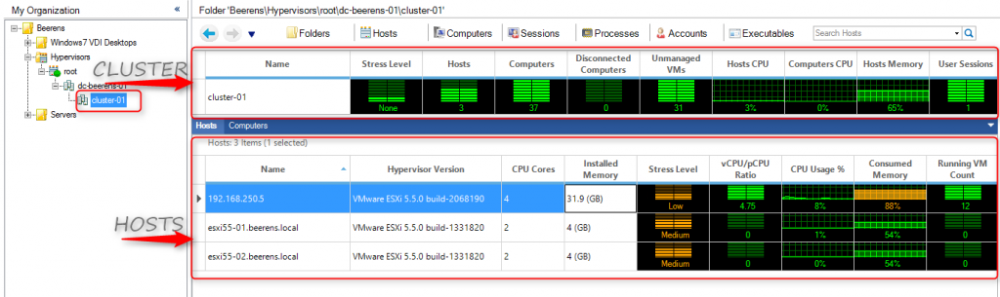](images/ESXI-hosts1.png)

To organize the computers a folder tree is created. For ESXi hosts, counters on CPU, Memory, Networking and storage can be monitored. For every counter a specific tresholds per folder can be configured. Here is an overview of counters that can be monitored on the vSphere layer:

[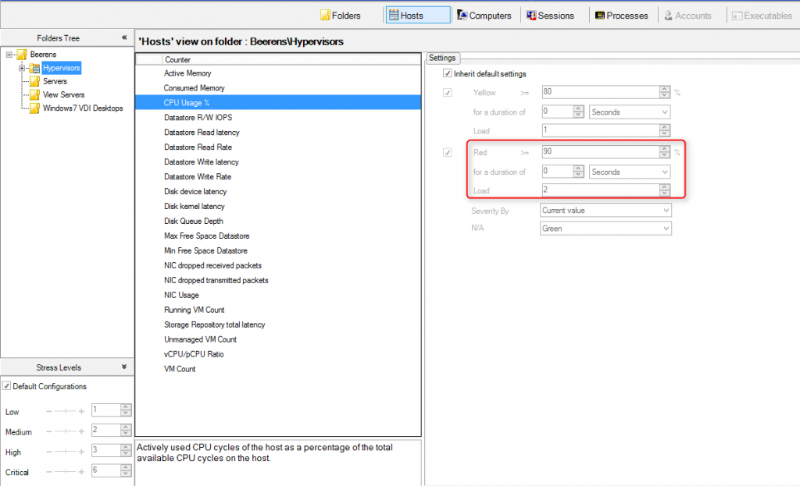](images/stresslevel.png)

The Stress level reflects the state of the performance metric reported to the console. In the following example we stressed  the ESXi hosts memory threshold (90% >)  by powering extra VMs.

[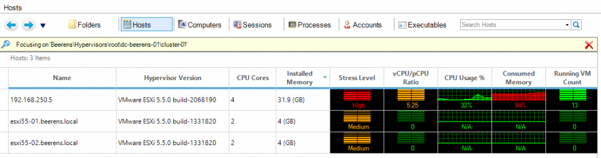](images/esxmon2.png)

The stress level jumped to high (red) within seconds.  So in real time you see what is happening to the vSphere layer. In the next example we stressed the datastore latency (> 22 ms)  and free datastore space (below 500 MB).

[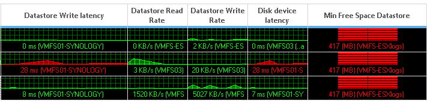](images/esxmon3.png)

In the above examples we see when a threshold is exceeded on the VMware ESXi hosts, it is displayed almost in real time in the ControlUp Console.

**Monitoring VMware Horizon View VDI Desktops**

To monitor VMware Horizon VDI desktops,  a lightweight ControlUp agent needs to be installed. The ControlUp agent can be installed in the Golden Image or deployed when the VDI desktop is running. It is important that firewall ports on RCP, WMI, Windows Remote Management and the ControlUp agent firewall ports are allowed. After adding the ControlUp agent, VMware View specific settings can be displayed.

[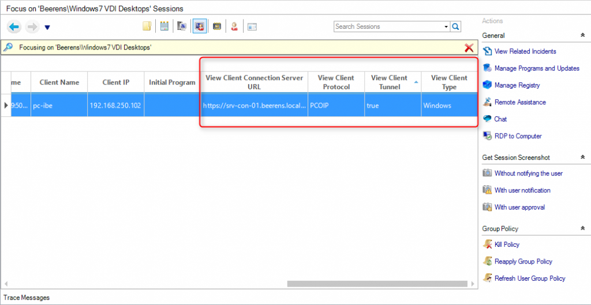](images/view-specific-session-settings.png)

In the following example we have 4 Windows 7 VDI desktops. As you can see the stress level is low or medium.

[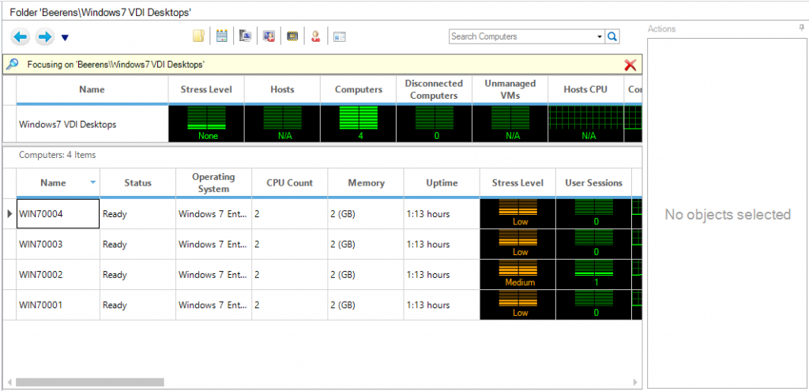](images/View-session-1.png)

In a Windows 7 VDI desktop we installed to 3e party tool "heavyload" to generate CPU load on the VDI desktop. When starting "Heavyload" the CPU spiked to 100%.

<table style="height: 113px;" width="1020"><tbody><tr><td>&nbsp;<a href="images/view-sesion-2.png">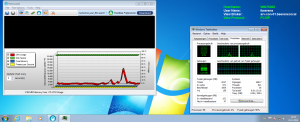</a></td><td>&nbsp;<a href="images/view-session-3.png">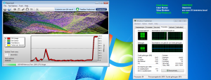</a></td></tr></tbody></table>

In the ControlUp console we looking in the Computer tab and see the Stress level after a couple of seconds changing to "High" and the CPU graph is raising to 100%.

[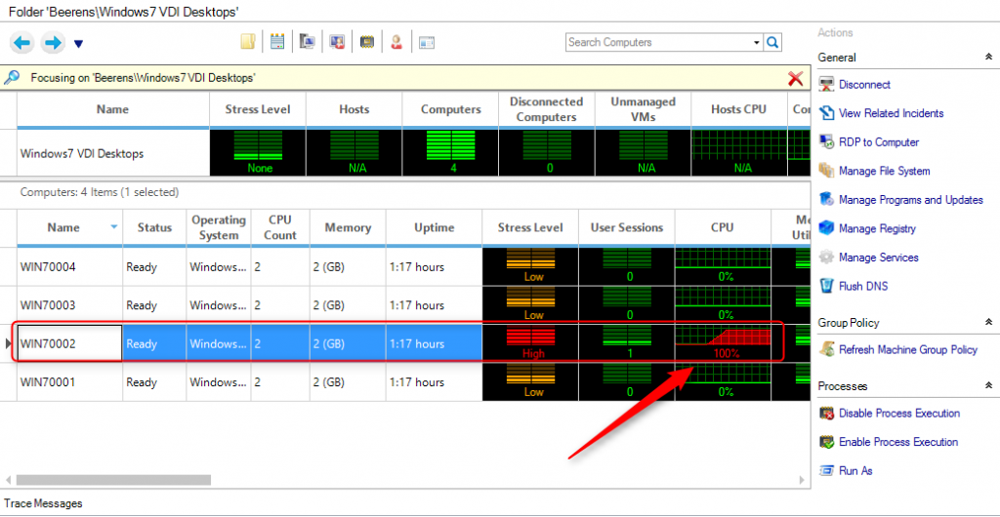](images/view-session-4.png)

To see what is causing the high CPU load we opened "Processes" tab and  sort on the Stress Level to see what process is causing the CPU load. We see that the Process "HeavyLoad.exe" is causing the high load.

[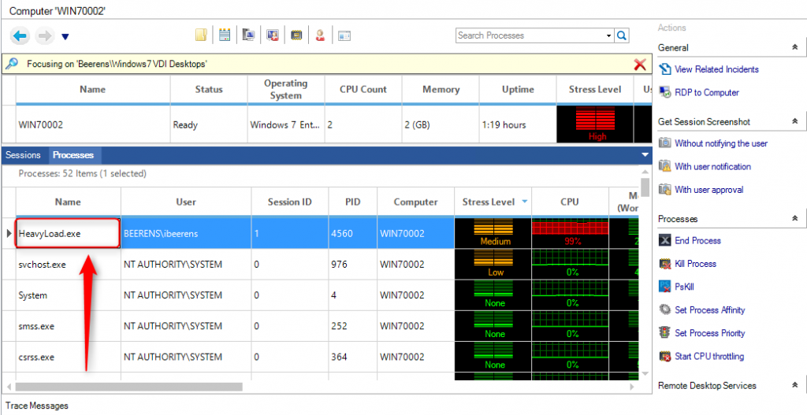](images/View-session-5.png)

On the right menu you see some actions that be performed. Here are some examples:

- Getting a Screenshot of the desktop
- Ending or killing the process
- Throttle the CPU for a process

In the following example we use the tool "heavyload" again to generate memory load.  Now we see that the Stress Level is critical again and that the Memory is red.

[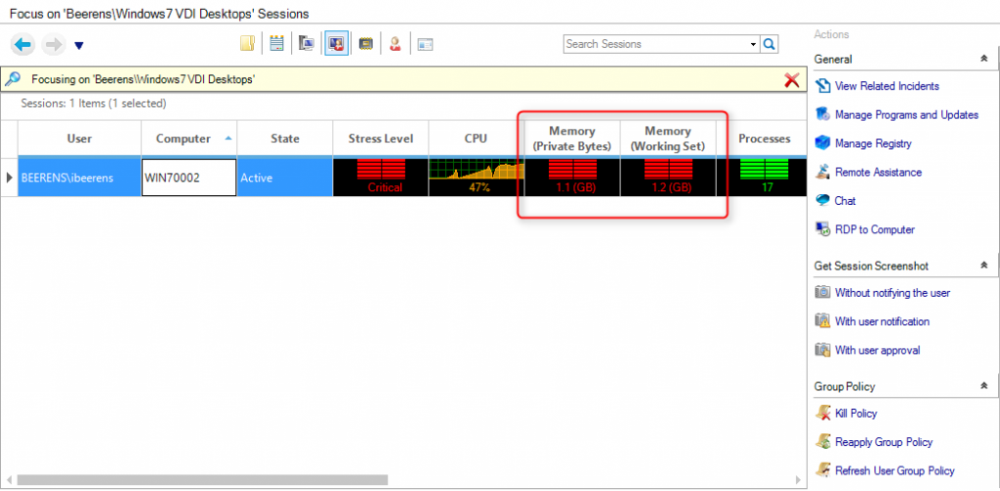](images/view-session-monitoring-memory.png)

To see what is causing the high memory load, open the" Processes" tab and  sort on the Stress Level to see what process is causing the high memory load. And again the process "HeavyLoad.exe" is causing the high memory load.

[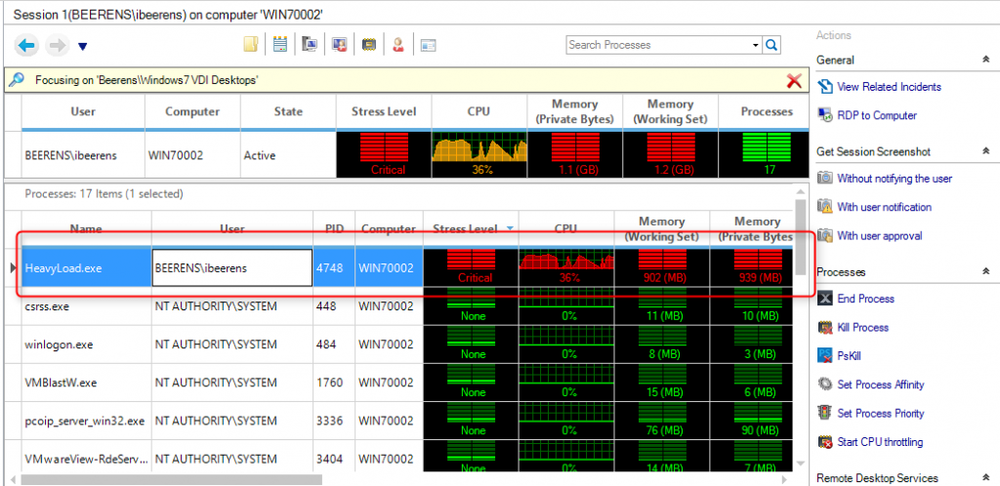](images/view-session-memory-1.png)

**Triggers**

When a service stops or a event occur it is possible to generate an alert. Using the "Incident Triggers" feature you can configure triggers to detect the following conditions:

- Stress level
- Windows Event
- Computer Down
- Process Started or Ended
- User Logged On/User Logged Off
- Session State changed

When a trigger occur an real time alert can be generated such as sending an email. There are pre-configured incident triggers for Horizon View services and events that occur.

[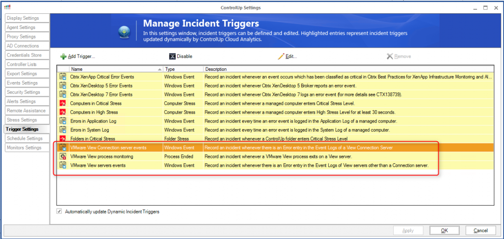](images/incident-triggers.png)

**Testing ControlUp**

ControlUp has a launched an Expert Program for vExperts and recognized VMware View Consultants. To apply for the license, register [here](http://www.controlup.com/products/controlup/expertprogram/). All other VMware View admins can simply download ControlUp from the ControlUp [website](http://www.controlup.com/) and enjoy the free unlimited 30 days trial.

**Conclusion**

Version 4 is the first version that supports VMware vSphere and Horizon View. In this blogpost I highlighted a couple of examples that shows the strength of ControlUp and how easy it is to install and use. In real time you see what is happing in your environment and drill from the hypervisor down to the Windows process level to identify what is causing the problem. This makes troubleshooting a lot easier on VMware Horizon View environments. The VMware Horizon View specific counters are a bit limited on the moment but ControlUp is asking your feedback on this. If you miss something let them know by using the "feature request" button.

ControlUp has a lot more features then showed in this blog post. Other features are for example:

- RDP to computer
- Remote Assistance
- Use RunAs accounts for actions
- Update and killing Group Policies
- Sending messages and chatting with users
- Multiple computers management on the file system, registry and services.

All these features makes ControlUp a powerful tool for the VMware Horizon View Administrator.