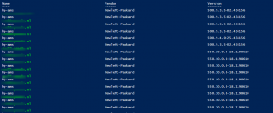

The last weeks several customers contacted me that one or more ESXi hosts are not manageable anymore. The ESXi host has the following symptoms:
- Unable to manage using the vSphere Client, Web Client or SSH.
- Unable to perform a vMotion
- On the ESXi console there is a message: **can't fork**
- Enable services from the console does not work

The VMs are still running on the ESXi host. This is a known issue and can occur when running the following versions of the HP AMS driver:
- hp-ams 500.9.6.0-12.434156
- hp-ams-550.9.6.0-12.1198610
- hp-ams 500.10.0.0-18.434156 (Added 13-11-2014)
- hp-ams-550.10.0.0-18.1198610 (Added 13-11-2014)

In some situations the ESXi servers is still manageable in vCenter, so vMotion can be used . In all the other situations shutdown the VMs by using RDP or SSH and reboot or reset the ESXi server. The HP AMS driver must be upgraded to version 10.0.1 or can be disabled. The VMware KB can be found [here](http://kb.VMware.com/selfservice/microsites/search.do?language=en_US&cmd=displayKC&externalId=2085618).

I developed a simple PowerCLI script to list the HP-AMS driver version of each ESXi host.

**Update 17-12-2014**: I developed a new PowerShell tool called VIBSearch. This this graphical tool it is easier to search a specific VIB. More information can be found here: [Link](https://www.ivobeerens.nl/2014/12/17/vibsearch-finding-vib-versions/)

Script:

```powershell
## Problem with HP AMS hp-ams 500.9.6.0-12.434156 and hp-ams-550.9.6.0-12.1198610
## http://kb.vmware.com/selfservice/microsites/search.do?language=en_US&cmd=displayKC&externalId=2085618
 
# Add PowerCLI module
Add-PSSnapin vmware.VimAutomation.core -ErrorAction SilentlyContinue
 
# VMware VirtualCenter server name
$VCserver = Read-Host "Enter your vCenter server"
$Username= Read-Host "Enter the Username"
$Password = Read-Host "Enter Password"
 
# Connect to the vCenter Server
Connect-VIServer -Server $VCserver -User $Username -Password $Password -port 443
 
# Clear screen
Clear
 
$GetHosts = Get-VMHost | Where {$_.ConnectionState -eq "Connected"}
ForEach ($VMHost in $GetHosts) {
$ESXCLI = Get-EsxCli -VMHost $VMHost
Write-Host $VMHost -ForegroundColor Green
$ESXCLI.software.vib.list() | Where {$_.Name -eq "hp-ams"} | Select Name,Vendor,Version | FT
}
 
# Disconnect session vCenter
Disconnect-VIserver -Confirm:$false
```

Example output:

[](images/hpams.png)


