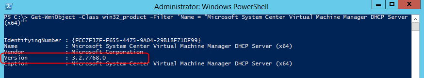

Update Rollup (UR) 4 for System Center 2012 R2 Virtual Machine Manager is released this week. The update contains a huge list of issues that are fixed and support for the following Linux systems is added:
- Red Hat Enterprise Linux 7 (64 bit)
- Oracle Linux 7 (64 bit)
- CentOS Linux 7 (64 bit)

Here are some tips for installing Update Rollup (UR) 4 for System Center 2012 R2 Virtual Machine Manager:

- Install the VMM Server and Administrator Console package by using Microsoft Update, WSUS or manual download

[](images/ur4.png)

- After the update of UR4 the SCVMM host must be rebooted
- Before Update Rollup 4, you had to run an SQL script after you installed an update package to make sure Update Rollups function correctly. As of Update Rollup 4, this step is NO longer required
- Update the VMM agents of all the SCVMM components such as Hyper-V hosts, VMM Server, Library and WSUS server. The SCVMM UR4 agent version is: **3.2.7768.0**
- The System Center Virtual Machine Manager DHCP Server (x64) component must be manually updated on all VMM Hyper-V hosts. To update the agent, first uninstall the old version by running the following command from an elevated PowerShell Command Prompt:
```
(Get-WmiObject -Class Win32_Product -Filter 'Name = "Microsoft System Center Virtual Machine Manager DHCP Server (x64)"' -ComputerName . ).Uninstall()
```
- Copy the DHCPExtn.msi from SCVMM server (default installed in C:\\Program Files\\Microsoft System Center 2012 R2\\Virtual Machine Manager\\SwExtn) to the Hyper-V host and execute the MSI. No restart of the Hyper-V host in needed
- Check if the version of the DHCP Server component. The version must match 3.2.7768.0. Use the following PowerShell command:

```
Get-WmiObject -Class win32_product -Filter 'Name = "Microsoft System Center Virtual Machine Manager DHCP Server (x64)"'
```
[](images/dhcpclient.png)

- Update the UR4 System Center Virtual Machine Manager Console on all servers for example the SCVMM admin workstations and Citrix Delivery Controllers.