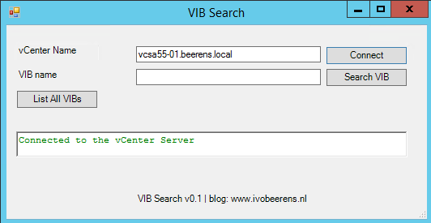

VIBSearch is a simple PowerShell script with a GUI that will search for a specified VIB or all the VIBS installed on the ESXi hosts. A VIB stands for vSphere Installation Bundle (VIB). VIBs are used to package and distribute ESXi software such as drivers. The GUI is designed with SAPIEN PowerShell Studio 2014.

With VIBSearch it is easily to verify that all the ESXi host in the cluster have the same VIB versions installed. VIBSearch can be used for example to easily identify the HP-AMS driver version on all the ESXi hosts.

**Requirements**

VIBSearch is tested with:

- PowerShell 5
- The latests PowerCLI modules
- For the Out-GridView cmdlet, PowerShell ISE is needed. Install ISE by using the following PowerShell commands:
    - Import-Module ServerManager
    - Add-WindowsFeature PowerShell-ISE

**Installing and executing VIBSearch**

- Download VIBSearch.txt, [link](https://www.dropbox.com/s/fevtlnlm3xdt0du/VIBSearch.ps1?dl=0)
- Open PowerShell and execute:
    - `Set-ExecutionPolicy  unrestricted`
    - `./vibsearch.ps1`

After executing the script the following GUI appears:

- To connect enter the FQDN or IP address of the vCenter name (1) and click on Connect (2) button

- A credential window appear, enter the credentials for authenticating (administrator) to the vCenter Server. For a domain login use: **user user@domainname** or **domainname\\username**

- After successfully authenticating to the vCenter Server there are two options to choose:
    - List All the VIBS:  List all the ESXi hosts in the vCenter Server
    - Search VIB: specify a VIB name for example "HP-AMS"

If authentication to the vCenter Server fails the following error is displayed in the PowerShell window:

**Example output:**

HP-AMS VIB versions

Intel NIC VIB "net-igb" versions

NVIDIA VIB versions:

Thanks to Francois-Xavier Cat (@LazyWinAdm) for helping me with the VIBSearch tool.