For a couple of months I’m searching for an extra whitebox host for extending my home lab environment. My current lab whitebox is a Haswell based whitebox (see: l[ink).](http://localhost/2013/06/25/haswell-low-power-whitebox-for-esxi-and-hyper-v/) Here is an overview of the new lab environment:

[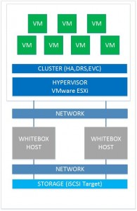](images/lab-environment.jpg)

For the new whitebox I  had the following requirements:

- Hardware such as NICs must be recognized by VMware ESXi
- Use 32 GB memory or more
- Low power consumption
- Expandable
- Small form factor
- Quiet
- Possibility to run nested hypervisors such as VMware ESXi and Hyper-V
- Remote Management
- Possibility to create a VMware Cluster and use vMotion, HA, DRS and DPM with the existing Haswell host

I reviewed the following popular home lab systems:

- Intel NUC
- Apple Mini
- Gigabyte BRIX

The main reason to NOT choose for one of the above systems is the only support 16 GB of memory. In November 2014 I  found a motherboard that passes all the requirements, the `ASRock C2750` motherboard. After some additional research I ordered the following parts to build this whitebox:

- ASRock C2750 motherboard
- Kingston 4 x8GB, DDR3, PC12800, CL11, Total 32 GB memory
- be quiet System Power supply 7 300W
- Cooler Master Midi Tower N300 ATX

VMware ESXi boots from an USB stick and the VMs are placed on a iSCSI target so no extra storage is needed. The above parts cost me around € 735,00.

The ASRock C2750D4I motherboard has the following specifications:

- Mini ITX motherboard
- CPU: Intel Avoton C2750 64-bit 8 cores processor (passive cooled)
- Graphics: ASPEED AST2300 16 MB
- Memory: 4 x DDR3 DIMM slots, max: 64 GB memory
- Controller: Intel C2750: 2 SATA3, 4 x SATA2 Marvell SE9172 2 x SATA 3, Marvell SE9230 4 x SATA3. Total of 12 SATA ports.
- NIC: Dual Intel i210 Gigabit LAN adapter
- 1 x PCIe 2.0 x8 slot
- Remote Management: BMC Controller with IPMI dedicated LAN adapter
- TPD of 20 watt

<table><tbody><tr><td><a href="images/ASrock.png" target="_blank">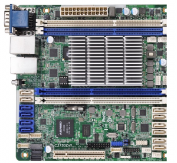</a></td><td><a href="https://www.ivobeerens.nl/wp-content/uploads/2014/12/IMG_3839.jpg" target="_blank">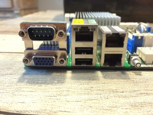</a></td></tr></tbody></table>

**CPU**

The Intel Avoton C2750 is an atom based processor and contains 8 cores. It is passive cooled and quiet. The Avoton processor is 64-bit and supports Intel VT-x with Extended Page tables (EPT), so it is possible to nest hypervisors such as ESXi and Hyper-V. The Atom processor with 8 cores gives enough CPU performance for my lab environment.

**Memory**

The motherboard contains 4 memory banks with a maximum of 64 GB DDR3 memory (4 x 16 GB). I choose to use 4 x 8 GB Kingston DDR3, PC12800, CL11 dimms because of the price. 16 GB modules are to expensive on the moment. The motherboard has 32 GB of memory.

**NICs**

The ASRock C2750D4I system contains a dual Intel i210 Gigabit LAN adapter. The Intel i210 adapters are standard recognized by ESXi 5.5 and Windows Server 2012 R2. No additional modifications or drivers are needed.

**Power consumption**

The 300 W Power Supply is more than enough. The processor has a TPD of 20 watt. This whitebox consumes around 35 W with a couple of VMware VMs on it.

<table><tbody><tr><td><a href="images/IMG_3949.jpg" target="_blank">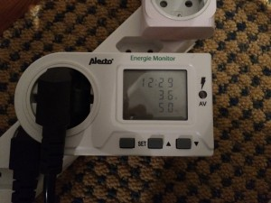</a></td><td></td></tr></tbody></table>

The ASRock C2750D4I system is part a VMware cluster with Distributed Power Management (DPM) enabled. When DPM kicks in only 4 watt is used.

**Remote Management**

Management and remote control is possible because of  the BMC (Baseboard Management Controllers) and IPMI (Intelligence Platform Management Interface).

<table><tbody><tr><td><a href="images/remote.png" target="_blank">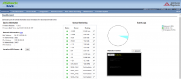</a></td><td><a href="https://www.ivobeerens.nl/wp-content/uploads/2015/01/remote2.png" target="_blank">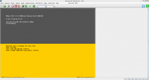</a></td></tr></tbody></table>

**VMware ESXi support**

On the ASRock C2750D4I system, VMware ESXi 5.5 Update 2 with the latest updates is installed.

<table><tbody><tr><td><a href="images/esxicpu.png" target="_blank">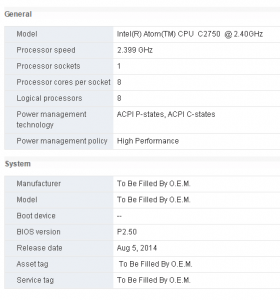</a></td><td><a href="https://www.ivobeerens.nl/wp-content/uploads/2014/12/esxi.png" target="_blank">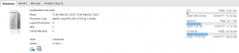</a></td></tr></tbody></table>

The Intel i210 Gigabit NICs and the Avoton AHCI controllers are recognized out of the box. So VMware VSAN (unsupported) could be an option to use.

<table><tbody><tr><td><a href="images/esxiintel.png" target="_blank">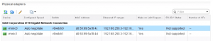</a></td><td><a href="https://www.ivobeerens.nl/wp-content/uploads/2014/12/esxicontroller.png" target="_blank">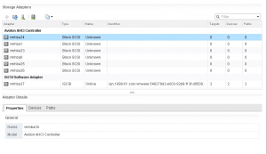</a></td></tr></tbody></table>

The SATA 6 Gb/s controller is not recognized by default. Follow the instruction explained in the following blog to enable the controller:

- How to make your unsupported SATA AHCI Controller work with ESXi 5.5 and 6.0, [link](http://www.v-front.de/2013/11/how-to-make-your-unsupported-sata-ahci.html).

**Update March 23, 2015**: Today I installed VMware ESXi 6.0 on the C2750. Everything seems to work.

 **Windows Hyper-V support**

As test I installed vNext Server Technical Preview on the ASRock C2750D4I system (with SSD as local storage) with the Hyper-V role enabled. The two Intel i210 Gigabit NICs are recognized out of the box. It has great performance.

<table><tbody><tr><td><a href="images/vnext-hyper-v.png" target="_blank">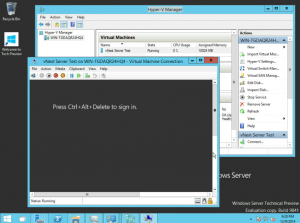</a></td><td><a href="https://www.ivobeerens.nl/wp-content/uploads/2014/12/hvtaskmgr01.png" target="_blank">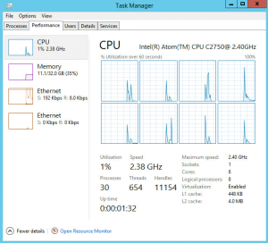</a></td></tr></tbody></table>

**Conclusion**

The ASRock C2750D4I motherboard is a great system for building or extending a home lab environment based on VMware or Hyper-V. This board gives enough performance for a home lab and meets all the requirements I had for an additional whitebox host. I use it mainly for nesting VMware ESXi and Hyper-V hypervisors.