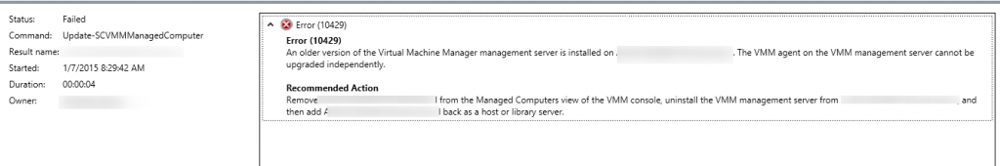
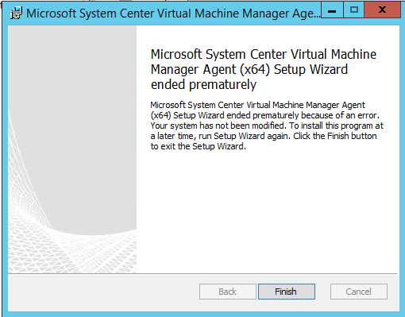

After updating System Center Virtual Machine Manager to Update Rollup 4 (UR4), one of the post installation tasks is updating the VMM agents on the Hyper-V hosts. Updating the VMM agent can be performed from the VMM console or using PowerShell. On one of the Hyper-V hosts I got the following error when trying to update the VMM agent from the console:

> Error (10429) An older version of the Virtual Machine Manager server is installed on **<server>**. The VMM agent on the VMM management server cannot be upgraded independently

I didn't found a reason why the VMM console was unable to update the agent on the Hyper-V host. The other hosts in the cluster are upgraded without a problem.

After some troubleshooting, the following steps resolved the VMM Agent update error:

- Manually uninstall the VMM agent from the Hyper-V host
- Copy the VMM agent from the VMM server to the Hyper-V host. The agent is default located on the following location on the VMM server: `Systemdrive\Program Files\Microsoft System Center 2012 R2\Virtual Machine Manager\agents\amd64\3.2.7768.0\vmmAgent.msi`
- Install the VMM Agent. When trying to install the VMM agent the following error occurred:

> Microsoft System Center Virtual Machine Manager Agent (x64) Setup Wizard ended prematurely

- Open a Command Prompt (Run as Administrator)
- Browse to the location where the VMM agent is stored
- Execute the following command: `msiexec /I vmmAgent.msi`
- In the SCVMM Console Reassociate the Hyper-V host and perform a cluster refresh

After these steps the updated VMM agent is installed on the Hyper-V server.