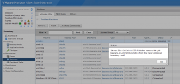
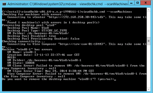

Sometimes you are unable to remove linked clones or stale desktop entries from the VMware Horizon View Administrator. In this example we have a missing VM in the VMware Horizon View Administrator.

 

When trying to remove the VM from the VMware Horizon View Administrator the following error is generated:

> Failed to remove VM...... from the View Composer Inventory

To remove the orphaned missing VM, you need to manually, remove the orphaned records from the ADAM and composer database, AD and vCenter Server. The process is described in the following KB:

- Manually deleting linked clones or stale virtual desktop entires KB, [link](http://kb.VMware.com/selfservice/microsites/search.do?language=en_US&cmd=displayKC&externalId=2015112)

Executing the procedure described in the KB can be a risky. VMware has released a new tool (fling) called "ViewDBChk". The ViewDBChk tool allows administrators to scan and fix provisioning errors that can not be addressed using the VMware Horizon View Administrator. This tool is supported on VMware Horizon View 5.3 and 6.0. Fling tools are not supported by VMware!  **For Horizon View 6.1 and later, the ViewDbChk tool is included with your View Connection Server installation**!

The Fling `ViewDbChk` can be found here, [link](https://labs.VMware.com/flings/viewdbchk)