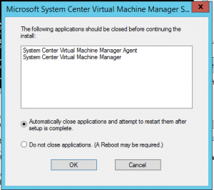

Here are some tips for installing System Center 2012 R2 Virtual Machine Manager Update Rollup (UR5):
- UR5 is available from Microsoft Update or by manual download. If you are not installing UR5 through Microsoft Update (e.g. you’re downloading the update and then installing it), you must install using elevated privileges. If you do not do this the update may fail silently.
- During the UR5 installion the System Center Virtual Machine Manager & Agent will be stopped
- 
- After the SCVMM UR5 server component, reboot the VMM server before installing the UR5 console
- Before Update Rollup 5, you had to manually update the System Center Virtual Machine Manager DHCP Server (x64) component. As of Update Rollup 5, this is no longer required. When updating the agent on the server the DHCP server components is updated too.
- 
- The new SCVMM UR5 agent build version is: **3.2.7895.0**
- The Microsoft System Center Virtual Machine Manager DHCP Server (x64) build version is still **3.2.7768.0**
- Make sure to update the agent on all the infrastructure servers such as the Update Server and library server. In VMM click on Fabric- Server for a complete overview
- 
- Refresh the cluster after updating the agents
- When starting the VMM console the following error appears:
- 
- This error is permission related. To solve this error add the "Authenticated Users" group to the AddInPipeline directory and assign read and execute rights. The installation of VMM can be found under: `<Driveletter>:\Program Files\Microsoft System Center 2012 R2\Virtual Machine Manager\bin\AddInPipeline.`

For all the details on SCVMM 2012 R2 UR5, see the following:

- KB3023195 - Description of the security update for Update Rollup 5 for System Center 2012 R2 Virtual Machine Manager, [link](http://support.microsoft.com/kb/3023195)