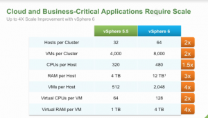
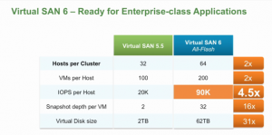
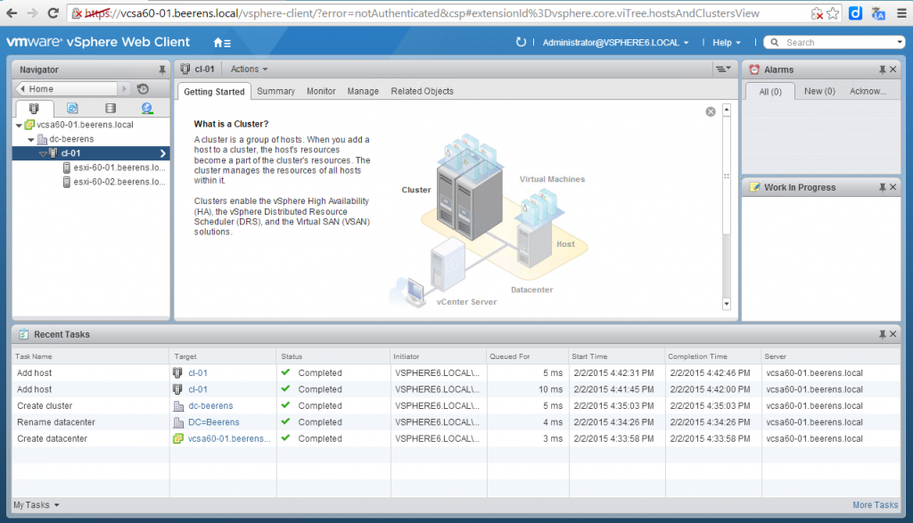

Here is an overview of the main new VMware vSphere 6 (over 650 new features and innovations) improvements announced today:

**Scalability**

- vSphere Clusters: Up to 64 nodes and 6000 VMs
- Hosts: 480 physical CPUs, 12 TB RAM, 64 TB datastores, 1000 VMs  and 32 serial ports. vGPU Nvidia support
- VMs: Up to 128 vCPUs and 4 TB vRAM

**vCenter Server**

- Platform Services Controller (PSC)**.** The Platform Services Controller (PSC) contains common Infrastructure Services such as:
    - Single Sign-On
    - Licensing
    - Certificate Authority
    - Certificate Store
    - Service (Product) Registration
    - Other future services
    - PSC is a central part that is used for example by vCoud Suite parts such as vCenter, vRealize Operations, etc.). For most environments (8 or less vCenter Servers) a vCenter Server with 1 embedded PSC is sufficient.
- Enhanced Link Mode (ELM). Enhanced Link Mode (ELM) will support Windows and vCSA deployments and require a Platform Services Controller (PSC).
- Microsoft Clustering support for vCenter Server. vCenter Server 6.0 will support the clustering of the vCenter Server in addition to the backend database.
- vCenter Server Appiance (vCSA):
    - ISO file that contains a guided installer
    - Embedded vPostgres database. As external database Oracle is supported.
    - Enhanced Linked mode support
    - VDP support for backup and recovery of the vCSA
    - More information can be found in this blog post, [link](https://www.ivobeerens.nl/2015/02/02/whats-new-vSphere-6-vcenter-server-appliance-vcsa/)

 **Storage**

- Storage I/O Control (SIOC).  Per VM storage reservation
- NFS 4.1 with Kerberos support. NFS client support for NFS 4.1
- Virtual Volumes (VVols) and Storage Policy-Based Management. Enables VM-aware storage. VVOl is offered by storage vendors such as NetApp, Dell, PureStorage, EMC, Nimblestorage, IBM and Tintri
- Virtual SAN (VSAN) 6 contains the following improvements:
    - Scalability improvements such as:
    - 
    - New On-Disk format for higher performance, efficient and scalable high performance snapshots and clones.
    - All flash support
    - Usability improvements in Web Client such as:
        - Storage consumption information
        - Resync status information
    - Failure Domains. Allow grouping of hosts into different logical failure zones. This ensures replicas from a VM are not provisioned onto the same logical failure zone. Failure Domains are no metro/stretched clusters! Failure Domains is also known as rack awareness.
    - Disks serviceability. Map the location of a magnetic or flash device from the Web Client on failures, SSD, local etc.
    - VSAN is sold as separate product and not included in the license!

**Availability**

- 64 node cluster support and 6000 VMs
- VMware VM Component Protection (VMCP)
- vMotion Across vCenter Servers.
- vMotion across virtual (distributed) switches
    - No need of shared vMotion is needed
- Long-Distance vMotion up to 100ms RTTs
    - Benefits: Permanent migrations between data centers
    - Disaster avoidance (DA)
    - SRM/DA testing
    - Multi-site load balancing
- Fault Tolerance (FT) increase support for 1, 2 and 4 vCPU VMs
- Integration with vCloud Air (replication and backup)
- vSphere Replication. 5 mins increments (5.5 was 15 minutes) and 2000k replicated VMs per vCenter
- App HA. Support for more business critical applications

**Network**

- Network I/O Control (NIOC)**.** Per VM and Distributed Switch bandwidth reservation

**Management**

- vSphere Web Client enhancements such as better performance and tagging improvements. The Web Client still uses flash!

- The vSphere Client C# is still available in this release. No new features are in this release. Hardware versions 9 to 11 features are read-only or unavailable in the vSphere Client C#.
- Multi-Site Content Library. Stores and sync VMs, Templates, OVFs, ISOs and scripts from one central location and sync the content across other vCenter Servers (sites)
- vSphere 6 has support for Hardware Version 11. Main improvements of Hardware Version 11 are:
    - Maximum video memory up to 2 GB (512 MB in Hardware Version  10)
    - PCI passtrough 16 devices (6 in Hardware Version  10)
    - 32 serial ports (4 in in Hardware Version  10)