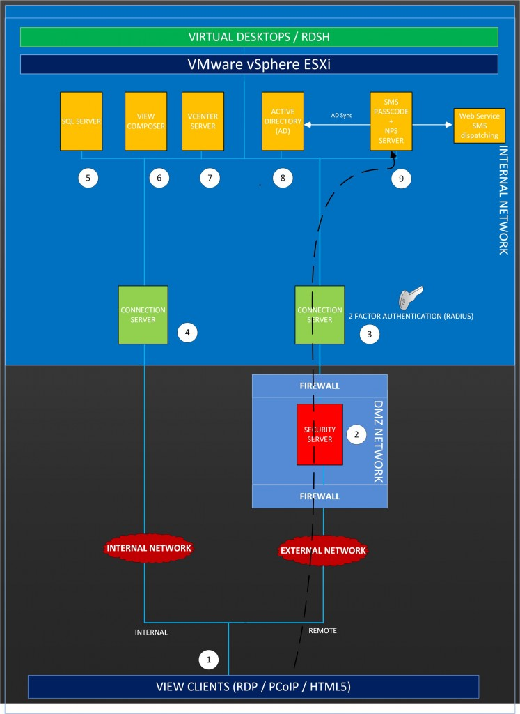
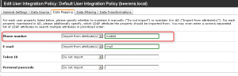
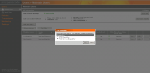

- Citrix Web Interface Protection
- RADIUS Protection
- Cloud Application Protection
- IIS Web Site Protection
- ISA/TMG Web Site Protection
- Windows Logon Protection
- Secure Device Provisioning (for ActiveSync devices)

In this review we test how-to integrate SMS PASSCODE with the latest version of VMware Horizon View using RADIUS authentication.

## **What is SMS PASSCODE**

Unlike traditional hardware-token based solutions, SMS PASSCODE works without distribution of any hardware-tokens. As a result, the logistic overhead involved is minimal and roll-out is much faster. On the mobile phone is no software installation needed. Just extract the cell phone number from the AD.

SMS PASSCODE sends a One-Time-Passcode (OTP) to the user mobile phone. SMS PASSCODE looks at multiple factors such as time, geo-location, and type of login system being accessed.

SMS PASSCODE offers a Multi-Factor Authentication (MFA) solution that adds an extra security layer to the VMware Horizon View environment. VMware Horizon View has support for RADUIS authentication.

## **LAB environment**

In the lab environment the following components are installed:

1. Horizon View Clients (PCoIP, RDP and HTML)
2. Horizon View Security Server
3. Horizon View Connection Server external
4. Horizon View Connection Server internal
5. Microsoft SQL Server
6. Horizon View Composer
7. vCenter Server
8. Active Directory Domain Controller
9. SMS PASSCODE version with Network Policy Server (NPS) role installed

For the external connection to the VMware Horizon View environment a Multi-Factor Authentication (MFA) is configured by using SMS PASSCODE. The internal Horizon View users don't use SMS PASSCODE to connect.

The following software versions are used:

- Windows Server 2012 R2 Active Directory (AD)
- Windows Server 2008 R2 for the SMS PASSCODE and NPS software role
- VMware vSphere 6
- VMware Horizon View 6.1
- SMS PASSCODE 7.2

Instead of using a GSM modem, a Web Service SMS dispatching service is used for sending messages. A GSM modem is highly preferred in a production environment.

## **Installation and configuration Management**

### **Installation of SMS PASSCODE**

SMS PASSCODE is installed on a Microsoft 32-or 64-bit Windows Operating System.. The core components of SMS PASSCODE are:

- **Database Service**. The database stores the SMS PASSCODE configuration and user data.
- **Transmitter service**. This service is responsible for dispatching messages and validation of SMS PASSCODE logons. Handles load balancing and failover between all GSM modems
- **Load Balancing service**. Service responsible for load balancing and failover.
- **Web Administration Interface**. Web site for maintaining user and configuration data

These core components can be distributed over one of more servers to provide redundancy and load distribution for enterprise 24x7 uptime demands.  In the lab setup all the core components are installed on a single server.

As Authentication Client Radius protection is selected during the installation.

**Network Policy Server (NPS)**

On the SMS PASSCODE server the Network Policy Server (NPS) role is installed for RADIUS authentication.

### **Configuration**

**Web Administration Interface (WAI)**

The Web Administration Interface (WAI) is available from the web browser on port 2000. From the WAI the configuration of SMS PASSCODE is done.

From the WAI we need to do the following main steps:

1. Configure AD integration and the messaging infrastructure used in the General settings
2. Configure the User Integration Policy (UIP)
3. Configure User Group Policies
4. Configure transmission infrastructure for creating a dispatching entity

### **Step 1. General Settings**

In the general settings tab AD integration in single sync mode is enabled. With single sync mode users are imported from a single user group.

In the globalization options the messaging infrastructure used. The following messages infrastructures can be used in SMS PASSCODE:

- SMS OTP
- E-mail OTP
- Voice call OTP
- Web service SMS OTP
- Token OTP
- Personal passcode OTP

The SMS OTP is the most secure option to use and highly preferable. In our lab environment we use Web service SMS OTP as messaging infrastructure. A 3rd party web service is used for SMS dispatching.

### **Step 2. User Integration Policy (UIP)**

User Integration Policies are used to configure how users in the SMS PASSCODE database are synchronized with users from one or more Active Directory stores.

When enabling AD integration, users are synced when belonging to a specified group or attribute. For example the mobile attribute is used to retrieve AD users. Only users with the phone number filled in are synced to SMS PASSCODE.

### **Step 3. User Group Policies (UGP)**

User Group Policies (UGP) are used for managing users. Every users is assigned to a UGP and automatically inherits the settings specified by this policy. For example the administrator could change type of passcode dispatching, SMS type (Flash/normal) or Self Service Site permissions in the UGP. A UGP manage user settings on a group basis or on individual basis by overriding the UGP .

We changed the default UGP for the dispatch type to “Send passcodes by web services SMS”.

### **Step 4. transmission infrastructure for creating a dispatching entity**

In our lab environment we don’t have a GSM modem for send SMS messages, so we used and configure a Web Service Dispatcher service for sending in SMS messages.

After these four main configuration steps we can test if the SMS message is sent to the user mobile phone by selecting the test button and choose for the Web Service Dispatcher option. A test SMS message is sent to the users mobile phone. If the SMS message arrives on the mobile phone the configuration is ready for the next step.

When the four main steps are performed it is possible to perform some optional additional steps such as:

- Adjust the passcode policy to reflect to the organization policy. For example adjust the minimal passcode length, composition of the passcode, lifetime and message composition for the SMS message that is sent to the mobile phone.
- Create Authentication policies and lockout periods settings
- Enable Geo IP and IP history lookup to identify where in the world your users are logging-in.
- Configure date and time restrictions
- Configure the Self Service Web Site. The Self-service web site is for maintaining the users account settings and Password Resets.

### **Network Policy Server (NPS)**

On the Network Policy Server a RADIUS Client profile is created. The RADIUS profile points to the VMware Horizon View Connection Server (3) that is configured for the external users. In this Client profile we enter the following information:

- Friendly Name.
- DNS or IP address of the Connection server.
- Manually assigned a shared secret that will be used for the RADIUS connection between the NPS and Connection Server.

### **VMware Horizon View external Connection Server configuration**

On the Horizon View Connection Server (3) for the external access we configure 2-factor authentication for Remote Authentication Dial-In User Service (RADIUS). On the VMware Horizon View Connection Server we create a RADUIS profile using the following settings:

 

In the primary Authentication Hostname/Address the IP address of the NPS server. NPS is installed on the SMS PASSCODE server. The same shared secret is used from the NPS Client configuration.

## **Connecting to the VMware Horizon View environment**

Externally users connect to the VMware Horizon View environment by using the VMware View Client and HTML Access.

### **VMware Horizon View Client**

When connecting externally to the VMware Horizon View environment by using the Horizon View Client, the following login box appears in the Horizon View Client:

After entering the AD user name and password credentials, a One-Time-Passcode (OTP) is send the user mobile phone.

Entering the OTP in the Next Code: field and you're authenticated to the VMware Horizon View environment and you see your pool entitlements.

### **HTML access**

Another option is to connect to the VMware Horizon View environment is by using HTML access. This option does not require any software other than a supported browser such as IE, Chrome or Firefox on the client. HTML access uses the Blast protocol instead of the PCoIP protocol.  The login steps are the same as the Horizon View client.

 **  ** 

## **Conclusion**

SMS PASSCODE is a multifactor solution that adds an extra security layer to the VMware Horizon View environment. SMS PASSCODE has the following pros:

- Stable and flexible product. We tested SMS PASSCODE for several months and it is a very stable product. We experienced no crashes or strange things during our tests.
- Simple installation, configuration and maintaining
- Can be used in Small and Midsize Business (SMB) till large Enterprise (24x7) environments (scalable).
- No extra software is needed on the users mobile phone
- No hardware-tokens are needed
- Because RADIUS authentication is used, it works with new versions of VMware Horizon View out of the box.

For SMS PASSCODE a Windows Operating System is needed. It would be great if in the future an appliance version can be used wihout the need of a Windows Operating System.

When working with external users that connect to your VMware Horizon View environment an extra security layer is needed besides the standard username and password.

SMS PASSCODE offers that extra layer of security by using 2-factor or Multi-Factor Authentication.

### **More information**

Want to try SMS PASSCODE live or request a free 30 day trial? Click the link. **vExperts can obtain a NFR license** by sending an email to support@smspasscode.com. Provide some documentation that proves you are a vExpert.

