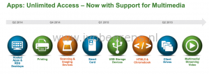
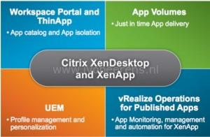

VMware announced last week what’s new with Horizon 6 (Q2 2015) as well as some brand new offerings that will help you to deliver and manage apps and end users across physical, virtual and cloud-hosted environments. Here are the announcements:

- User Experience improvements
- Linux Desktops support (GA in Q2)
- User Environment Manager (UEM) (GA in Q2)
- VMware Workspace Environment Management (WEM)
- Free SysTrack Desktop Assessment tool

**User Experience Improvements**

Some new improvements for the upcomming Horizon 6 version are:

- USB Mass storage support for RDS and Hosted Apps
- Client drive redirection support. For example make an c-drive available in a RDS desktop.
- VMware Horizon Client for Chrome Access (Chromebook) with support for Horizon Hosted Apps. Apply for the early access program here, [link](http://www.surveymethods.com/Preview.aspx?BDA3B7BAE9F3EAF8FCB7B1BAB1FDE8E7B7FCECF8FE87BCE3BCFCE0EFB4F9E1EB&DO_NOT_COPY_THIS_LINK).

**Linux Desktop Support**

Linux support for VDI desktops will be available in Q2 2015. Ubuntu, Red Hat Enterprise Linux and CentOS VDI desktops are supported for 3D and Linux office applications. A nice thing about Linux VDI desktop support is the Microsoft desktop licensing is eliminated.

**User Environment Manager (UEM)**

VMware has acquired Immidio in February 2015. Immidio is now called User Environment Manager (UEM). UEM offers personalization and dynamic policy configuration across any virtual, physical and cloud-based environment. UEM has no new features, only VMware branding is included in this release. UEM will be sold separately as standalone product, included in the Horizon View Enterprise license and available in the VMware Horizon Application Management Bundle.

VMware has released a VMware User Environment Manager Deployed in 60 Minutes or Less whitepaper. UEM is a simple and straightforward to deploy and get up-and-running, as there is no extra infrastructure needed to configure. The whitepaper can be found here, [link](http://blogs.VMware.com/consulting/files/2015/04/VMW_15Q2_TD_User-Environment-Manager_042415_FINAL.pdf).

**VMware Workspace Environment Management (WEM)**

VMware Workspace Environment Management (WEM) is a bundle of products. This bundle is called the VMware Horizon Application Management Bundle. The following products are  includes in the bundle:

- VMware User Environment Manager (UEM)
- VMware vRealize for Published Applications (End-to-End Monitoring). In Q2 XenApp support will be added.
- VMware App Volumes (Real-Time application delivery)
- VMware ThinApp (Application Virtualization)
- VMware Workspace Portal (central portal for your applications)

The VMware Horizon Application Management Bundle is sold as standalone product and is available to Citrix Customer for example.

**SysTrack Desktop Assessment**

SysTrack Desktop Assessment (Lakeside software)  is a free assessment tool. For customers considering the purchase of VMware Horizon 6 or VMware Horizon Air, Systrack Desktop Assessment provides quick and easy insight into end-user computing infrastructure, applications and desktops. This FREE service provides you with everything you need to gain visibility into your end user environment, understand the best deployment options for Horizon and assess your costs.  More information can be found here, [link](http://www.VMware.com/files/microsites/latitude/index.html).
