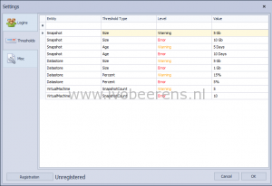
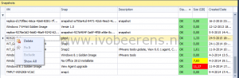

To monitor and manage VMware Virtual Machine Snapshots Opvizor has released a tool called Snapwatcher. As consultant I see often that admins don’t have an overview of all the snapshots that exists in their environment. The main concerns with Virtual Machine snapshots are:

- Snapshots are created and forgot to remove
- Snapshots can very quickly grow in size
- Snapshots filling datastore space
- Delta files may cause decreased Virtual Machine and host performance

In this review Opvizor Snapwatcher is tested. With the Snapwatcher tool it is possible to centrally monitoring and managing snapshots one on more more vCenter server environments.

### **Installation**

The installation of Snapwatcher is simple. Before installing make sure the requirements are met:

- Windows Installer 4.5
- Microsoft .NET Framework 4 (x86 and x64)
- VMware vCenter 4.1 or higher

Download and  installation the Snapwatcher application.  The installation downloads the latest bits from opvizor.com and installs Snapwatcher.

Every time Snapwatcher is started it checks for the latest updates. So Snapwather is always up-t0-date.

### **Configuration**

The first configuration step is adding one or more vCenter Servers:

After adding the vCenter Server(s), thresholds on warning and error levels can be set, for example:

- Size and age of the snapshot
- Size and percentage of the datastore
- Amount of snapshots for a Virtual Machine

### **Monitor**

The dashboard is divided in seperate windows. The screenshot below lists the dabboard with all the 5 windows:

Each window can be resized and re-ordered. The 5 windows displays the following information:

1\. **Overview of the 5 largest snapshots**. The amount of snapshots displayed is configurable.

2\. **Snapshot Disk Waste History (GB)**. Displays how much disk space is wasted over a period of time.

3\. **Overview of all the snapshot**. All the snapshots are listed with there status.  Snapshots can be sorted on VM or snapshot name, description, status, Size (GB) and created Date. Actions can performed against snapshots such as delete, fix it and exclude.

4\. **General overview information**. Display information about the number of vCenters, ESXi servers, VMs, VMs with snapshots added, the total snapshots and snapshot size.

5\. **Work History**. Displays information about the deleted snapshots and sizes.

### **Manage**

From the dashboard the following actions can be performed against snapshots:

**Refresh:** Refreshes the dashboard and perform an updated inventory of the snapshots.

**Delete**: Remove the snapshot from the VM.

**Exclude**: Snapshots can be excluded in the dashboard from displaying. This can be handy for template VM with snapshots or VMware Horizon View Linked Clones.

**Fix It**: Fix It repairs broken snapshots are snapshots that are not managed by the vCenter Server but are still getting used by the Virtual Machine. In the vSphere Web/Client this status is showed as "Virtual Machine disks consoldition is needed". In Snapwatcher the status is invalid.

 

### **Licensing**

When the trail period (7 days) is expired it is still possible to use Snapwatcher. The following Enterprise Edition features will not work when the trail period is over:

- Fix broken and inconsistent snapshots with our patent pending technology
- Ignore certain VM snapshots
- Track your VMware snapshot history

### **Conclusion**

Opvizor Snapwatcher is a great tool for a VMware admin to centrally monitor and manage all the snapshots that exists in there VMware environment.