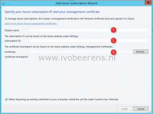
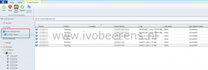
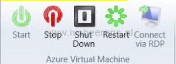

With Update Rollup 6 it is possible to add one or more Azure subscriptions to SCVMM 2012 R2. When the Azure subscription is added in SCVMM, it is possible to perform some basic actions such as:

- Add and Remove one or more Azure subscriptions by using the VMM console.
- See a list view with details and status of all role instances in all deployments in that subscription.
- Manually refresh the list of instances.
- Perform basic actions on the instances:
    - Start
    - Stop
    - Shutdown
    - Restart
    - Connect via RDP

**To add the Azure Subscription to SCVMM 2012 R2 UR6 following these steps**:

1\. Install UR6 to System Center Virtual Machine Manager (SCVMM) 2012 R2, l[ink](https://support.microsoft.com/en-us/kb/3050317).

2\. Create a self-signed Azure management certificate. The self-signed must have a key length of at least 2048 bits and should reside in the Personal certificate store. To create a self-signed management certificate, the makercert tool is used. Makecert is part of  Windows SDK. The SDK can be downloaded here, [link](http://www.microsoft.com/en-us/download/details.aspx?id=8279).

Install the SDK and choose as feature to install “Windows Software Deployment”. After the installation copy the `makecert` tool to the SCVMM server.

3\. Create the self-signed certificate with makecert with the following command:

```makecert -sky exchange -r -n "CN=<CertificateName>" -pe -a sha1 -len 2048 -ss My "<CertificateName>.cer"```

**Example:**

```makecert -sky exchange -r -n "CN=ivobeerensazure" -pe -a sha1 -len 2048 -ss My d:\install\ivobeerensazure.cer```

4. The certificate needs to be present in the Current User \\ Personal store of the computer running the VMM console.

5\. To upload a management certificate to Azure, go to the Settings page in the Management Portal, and then click **MANAGEMENT CERTIFICATES**.

6\. In SCVMM start the Add Azure Subscription Wizard, click the Azure Add Subscription button. The wizard is a single page dialog box:

[](images/SCVMM.png)

- **Display Name**: Enter the display name
- **Subscription ID**: The subscription ID can be found on the Azure website under settings
- **Certificate**: Add the self-signed certificate by using the browse button

After the Azure subscription is added, the Azure Virtual Machines are listed in SCVMM:

[](images/azure.png)

Basic actions can be performed on the Azure VMs such as:

[](images/stopstart.png)

UR6 adds support for managing Azure VMs. The management is very basic. So hopefully on the next releases the management support for Azure VMs will be improved.