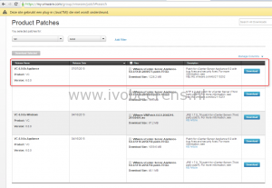
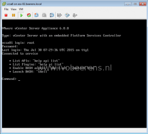
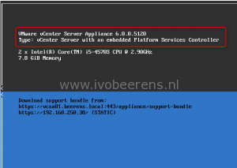

The patching process in vCenter Server Appliance (vCSA) version 6 is changed from previous versions. It is not possible anymore to use the Virtual Appliance Management Interface (VAMI) and update the appliance using the User Interface. The new way to patch the vCenter Server Appliance involves the following steps:
- Download the patch from the VMware Patch Download Center, [link](https://my.VMware.com/group/VMware/patch).
- Choose vc and select version 6.x
- Download the latest patch ISO

[](images/1_patch.png)

- Attach the \*.ISO to the vCenter Server Appliance.
- Open a console session or SSH (SSH must be enabled) to the appliance. In the console session press ALT + F1 and login.

[](images/vcsa.png)

- Stage the ISO using the following command

```
software-packages stage --iso  --acceptEulas
```

- See the staged content

```
software-packages list --staged
```

- Install the staged content

```
software-packages install --staged
```

- Reboot the appliance

```
shutdown reboot -r
```

- After the reboot check the new vCenter Server Appliance build version

[](images/vcsa-version.png)

The easy updating process that was used in the vCenter Server Appliance 5.x is gone. The new update process involves more manually steps. We hoping that the easy updating will return in further releases of the vCenter Server Appliance.