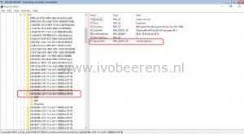
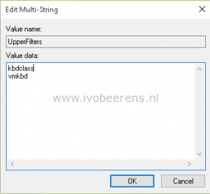

After installing the VMware Horizon View Agent (6.1.1) on a Windows 10 (tested with build 10240), it generates a Blue Screen Of Death (BSOD) when pressing Ctrl+Alt+Del/Ins.

The error is:
> DRIVER_IRQ_NOT_LESS_OR_EQUAL (kbdclass.sys).

To fix the problem (The solution was found on the Microsoft Community site, [link](http://answers.microsoft.com/en-us/insider/forum/insider_wintp-insider_devices/build-10130-enterprise-x64-bsod-with-VMware/d8c52293-2f4f-42fd-86dc-b002b3ae8b09)):

- RDP to the Windows 10 VM
- Edit `HKLM\SYSTEM\CurrentControlSet\Control\Class\{4D36E96B-E325-11CE-BFC1-08002BE10318}\UpperFilters`
- Put the kbdclass before the vmkbd value
- Reboot the VM

 

After changing the UpperFilters value I was able to login the Horizon View desktop without BSOD.