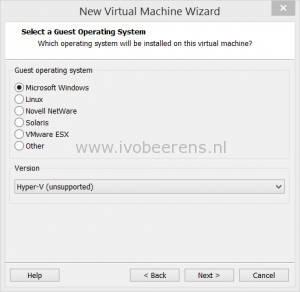
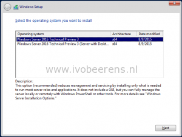
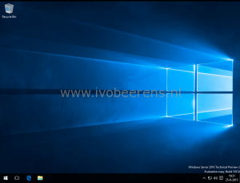
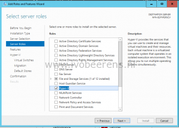
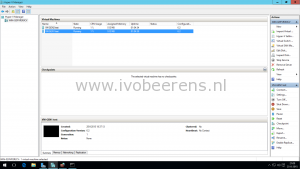

Windows Server 2016 Technical Preview 3 (TP3) is released with some cool new features. An easy way to test Windows Server 2016 TP3 is to use VMware Workstation. Windows Server 2016 can be installed with the Hyper-V role and have some VMs nested with minimal configuration.

For this test i used the following hard-and software:

**Hardware**: Dell Latitude E6540 with an Intel i5-4310M CPU and 16 GB memory.

**Software:** As desktop OS Windows 8.1 Enterprise, VMware Workstation 12 PRO and Microsoft Windows Server 2016 TP3.

To install Windows Server 2016 and enable the Hyper-V role and nest VMs use the following steps:

- Open VMware Workstation
- Create a new custom Virtual Machine
- Choose the highest VM hardware compatibility -> Workstation 12.0
- In the guest Operating System Installation -> browse to the Windows Server 2016 ISO
- As Guest Operating System choose -> Microsoft Windows and as version -> Hyper-V (unsupported)

[](images/1.png)

- Give the VM one or more CPU's and 4 GB of memory if you want to install some VMs in Hyper-V
- Controller -> LSI Logic SAS
- Virtual disk type -> SCSI
- Create a new virtual disk of 40 GB of more. (For the best performance use -> Allocate all disk space now)

You're ready to install Windows Server 2016 you have two options: Windows Server with or without GUI.

[](images/3.png)   [](images/6.png)

- After the installation add the Hyper-V role and reboot the server.

[](images/7.png)

- When choosing for the core version install the hyper-v with the following PowerShell command:

```PowerShell Install–WindowsFeature Hyper-V```

- Open Hyper-V Manager and create one or more VMs

[](images/Hyper-V-Manager.png)

When having limited hardware resources and want to test Hyper-V in Windows Server 2016, VMware Workstation is a great choice. Without minimal effort it is possible to install Windows Server 2016, add the Hyper-V role and nest some VMs.