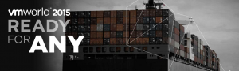

Last week I attended VMworld 2015 Europe conference. I had a great week filled with breakout sessions, Hands-on Labs, Solutions Exchange, parties, chats and great people.

A few new announcements were made such as:

- vRealize Automation 7 – Introducing unified service blueprint capabilities to enable IT and DevOps teams to simplify and accelerate the delivery of integrated multi-tier applications with application-centric networking and security across multiple clouds.
- vSphere Integrated Containers and VMware Photon OS – Building on the support for VMware Photon OS on vCloud Air, vSphere Integrated Containers is now also available on the cloud platform, allowing IT teams to truly support any application, including containerized applications, on a common vCloud Air based infrastructure.
- vCloud NFV platform – Designed to help communications service providers accelerate their implementations of Network Function Virtualization
- Acquirement of Boxer, [link](https://blogs.VMware.com/euc/2015/10/vmworld-europe-2015.html), [link](http://www.getboxer.com/)

The rest of the VMworld announcements can be found in my VMworld 2015 US  blog post, [link](https://www.ivobeerens.nl/2015/09/01/whats-announced-at-vmworld-2015/).

After VMware there is a lot of content available. Here's an overview of locations where VMworld content can be found:

- The session recordings can be found within the Schedule Builder, [link](http://www.vmworld.com/en/europe/learning/schedule-builder.html)
- VMworld blog, [link](https://blogs.VMware.com/vmworld/)
- VMworld Twitter, [link](https://twitter.com/VMworld)
- VMworld YouTube Channel, [link](https://www.youtube.com/channel/UCaC9l9CYIEazFB5-pWfCNKw)
- Hands-On Labs, [link](http://labs.hol.VMware.com/HOL/catalogs/)
- vBrownBags YouTube Channel, [link](https://www.youtube.com/channel/UCaZf13iWhwnBdpIkrEmHLbA)

Next year VMworld will be held on:

- VMworld 2016 US, August 28 - September 1 in Las Vegas
- VMworld 2016 Europe, October  17 - 20  in Barcelona

Hope to see you there again!