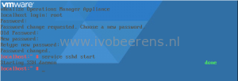

After upgrading vRealize Operations Manager to version 6.1 the Horizon View metrics are not collected anymore. On the Horizon View Connection Server where the vRealize broker agent is installed the following error is displayed in the logs:

> vRealize Operations Manager broker error "javax.naming.NameNotFoundException"
> ERROR   BrokerPoll message sending error: javax.naming.NameNotFoundException: V4V-BrokerMessageServer

The logs can be found in the following location on the Horizon View Connection broker:
`c:\ProgramData\VMware\vCenter Operations for View\logs\v4v_broker_agent_cfg.... log`

To resolve this error you need to restart the collector service on the vRealize Operations Manager Appliance. Run the following steps:

- Open a console session on of the vRealize Operations Manager collector node (SSH is disabled by default)
- Press ALT- F1 in the console session
- Log in as root user with no password
- Change the password the first time
- Restart the collector service by using the following command:

`service VMware-vcops restart collector`

It can take serveral minutes to pair the Broker Agent with the Horizon View adapter.

The SSH Service on the vRealize Operations Manager Appliance is disabled by default. To enable and start the SSH service use the following commands:

- Start the SSH service

`service sshd start`

- To configure SSH to start automatically

`chkconfig sshd on`

- Check the status of the SSH service

`chkconfig`

