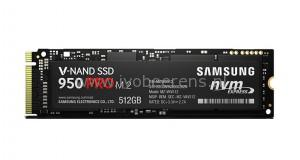

Last month I extended my VMware ESXi and Hyper-V home lab with a Samsung 950 Pro SSD. The Samsung 950 Pro SSD is the next-gen SSD that has the following characteristics:

- Uses V-NAND memory and the Non-Volatile Memory Express (NVME) protocol. This takes away the 600 MBps bandwidth limit with the SATA protocol.
- Takes advantage of the PCIe Gen 3 x4 (up to 32 Gb/s) interface
- Available in 256 and 512 GB at the moment. In 2016 larger sizes will be available
- The Samsung 950 PRO has a M.2 form factor (2208) interface

These improvements results in being one of the fastest consumer SSD on the market today. In my current home lab don't have a PCIe Gen3 x4 slot or a M.2 interface. I found a "interface converter PCI-Express, M.2 NGFF" (l[ink](https://www.conrad.nl/nl/interface-converter-pci-express-m2-ngff-1192250.html)) adapter. It's the same adapter as the Lycom DT-120 ([link)](http://www.lycom.com.tw/DT-120.htm) another great blog called TinkerTry is referring to ([link](https://tinkertry.com/how-to-install-a-2nd-samsung-950-pro-m2-nvme-on-superserver)). The adapter converts the M.2 interface to a PCIe interface slot.

 

The Lycom DT-120 adapter has the following specifications:

- Single M.2 slot (There are Dual M.2 controllers available on the market)
- The adapter cost around € 17,00
- Does not require any driver
- Supports PCIe 2280,2260 and 2242
- Supports PCIe 1.0, 2.0 and 3.0 slots on the motherboards

**Configuration** 

My first step was checking if the firmware is up to date with the Samsung Magician software.

In Windows 2012 R2 the Samsung 950 Pro SSD is standard recognized. The latest drivers and software can be download here, [link](http://www.samsung.com/global/business/semiconductor/minisite/SSD/global/html/support/downloads.html).

**VMware ESXi**

The Samsung 950 PRO is recognized by default in VMware ESXi 6 Update 1.

**Benchmark**

With ATTO software a simple benchmark on a Samsung 840 SSD (based on the SATA protocol) and the Samsung 950 Pro is performed. The ESXi host is a whitebox with the following hardware specifications:

- Gigabit GA-Z870D3HP
- Intel i5 4570S
- 32 GB memory
- Lycom DT-120 adapter is placed in a PCIe x16 slot
- Samsung 840 connected via SATA
- Samsung 950 Pro SSD placed on the Lycom DT-120 adapter

A VM with a 10 GB Thick Provisioned Eager Zeroed VMDK disk is attached. The disk is formatted as NTFS with a standard (4 KB) block size.

The Left picture is the Samsung EVO 840 and the right picture is the Samsung 950 Pro.

 

As you can see the read and write performance is multiplied by 3 on the Samsung 950 Pro with the M.2 interface converter . These are pretty impressive numbers for a consumer SSD.