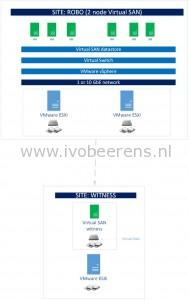
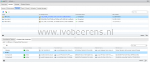
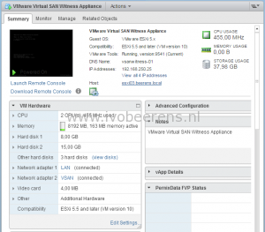

Virtual SAN requires minimal 3 ESXi hosts. With version 6.1 of Virtual SAN, Remote Office/Branch Office (ROBO) and small SMB customer environments are supported with Virtual SAN on 2 ESXi nodes. With a 2 node Virtual SAN cluster options such as HA, DRS and vMotion are fully supported.

In a ROBO configuration you have two Virtual SAN data nodes and one witness node. The Virtual SAN data nodes can be in one location. The witness node can reside in the same or another location (not on the Virtual SAN).

A virtual witness appliance is needed when a split brain occurs or performing maintenance to figure out what VMs does have quorum (more than 50% VMs  objects needs to be available). This can can be 1 ESXi host with Virtual SAN and the witness or 2 ESXi hosts with Virtual SAN.

A Virtual SAN ROBO environment example looks like this:

- 2 VMware ESXI with Virtual SAN enabled
- A witness appliance is running on a ESXi server in the same or other site.

Here are some considerations for using Virtual SAN ROBO:

**Witness**

- With Virtual SAN ROBO, a witness appliance is needed. The witness appliance is placed on a third ESXi server. This hosts does not need a Virtual SAN license and SSD disk.
- The witness appliance is a nested ESXi host (ESXi running in a VM).
- It is not supported to run the witness on Virtual SAN.
- The witness hosts stores only VM witness components (metadata).
- The VMs are only protected by a single failure (FTT=1).

- The virtual witness appliance can be configured in the following flavors (depending on the supported VMs):

<table style="height: 121px;" width="409"><tbody><tr><td></td><td><strong>Tiny</strong>

<strong>&lt;=10 VMs)</strong></td><td><strong>Normal</strong>

<strong>&lt;=500 VMs</strong></td><td><strong>Large</strong>

<strong>&gt; 500 VMs</strong></td></tr><tr><td><strong>vCPUs</strong></td><td>2</td><td>2</td><td>2</td></tr><tr><td><strong>RAM</strong></td><td>8</td><td>16</td><td>32</td></tr><tr><td><strong>Virtual disks (*1)</strong></td><td>8 GB boot

10 GB SSD

15 GB HDD</td><td>8 GB boot

10 GB SSD

350 GB HDD</td><td>8 GB boot

10 GB SSD

350 GB HDD</td></tr><tr><td><strong>MAX witness components</strong></td><td>&nbsp;750</td><td>&nbsp;22000</td><td>&nbsp;45000</td></tr></tbody></table>

**(\*1)** The SSD and HDD are virtual disks. There is no need to have a physical SSD disksin the ESXi host were the witness appliance resides**.** 

**Hardware**

- Deploy Virtual SAN on certified hardware. Check the Virtual SAN HCL!
- For a Virtual SAN disk configuration a minimal of 1 SSD and 1 Magnetic disk is needed. These disk cannot be used for booting ESXi
- For booting ESXi use a USB, SD or SATADOM device
- A small ESXi host can be used for the witness appliance. The witness appliance has no data, only metadata.

**Networking**

- Cross connecting 2 Virtual SAN ESXi nodes is NOT supported
- For 10 or less VMs a 1 Gbps network connection can be used. For >10 VMs use 10 Gbps
- Network bandwith to the witness: 1.5 Mbps
- Latency to the witness: 500 Milliseconds RTT
- Latency between the data nodes: 5 Milliseconds RTT

**Licensing**

- Virtual SAN is licensed separately.
- **Virtual SAN for ROBO** is a license that includes a 25 VM pack license. This license does not include the stretched cluster and All-flash options.
- A maximum of 1 Virtual SAN for ROBO license may be used per site.
- When running less than 25 VMs consider a VSAN standard of advanced license. The standard and advanced licenses are licensed per CPU socket.
- Consider single socket CPU servers to decrease the licensing costs.
- Consider vSphere Essentials (plus) for licensing the vSphere environment to reduce licensing costs.
- Consider ESXi Hypervisor (free) for placing the witness appliance. ESXi Hypervisor cannot be managed by a vCenter Server!
- For each ROBO Virtual SAN you need a dedicated witness appliance.

**vCenter Server**

- When running the vCenter Server on top of Virtual SAN, powering down the Virtual SAN cluster involves a special procedure ([link](http://kb.VMware.com/selfservice/microsites/search.do?language=en_US&cmd=displayKC&externalId=2142676)). Consider placing the vCenter Server on the witness host for simplicity.