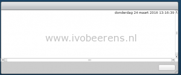
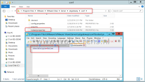
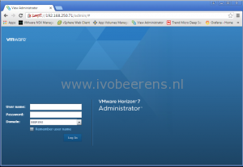

After upgrading to VMware Horizon View 7, the administrator webpage displays a blank error window when trying to connect using the IP address of the Connection Server.

Horizon View 7 adds new security features that checks for the original URL for the web request. If not, it rejects the request and display the blank error window.

Steps to resolve this:

- Use `https://FQDN/admin`

**or**

- On every Connection Server create a `locked.properties` text file in `c:\Program Files\VMware\VMware View\Server\sslgateway\conf`
- Add the following line:
    `checkOrigin=false`

- Save the file
- Restart the "VMware Horizon View Connection Server" service

After the modification you're able to connect to the View Administrator URL using the IP address of the Connection Server.

