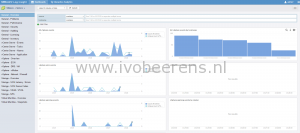
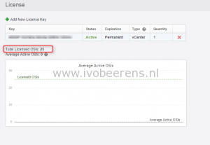
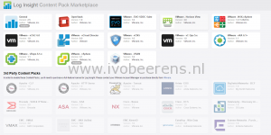

VMware released vRealize Log Insight 3.3. vRealize Log Insight is a log monitoring and analytics dashboarding tool like Splunk.

In version 3.3 a new product license is added. For each vCenter Server **Standard** license you will get a **free** 25 OSI pack license for vRealize Log Insight. So every customer with a vCenter standard license can use vRealize Log Insight with no additional costs. OSI stands for Operating System Instance. For example 1 vCenter Server and 10 ESXi hosts counts as 11 OSI licenses. With a 25 OSI pack, 14 licenses are available for monitoring other devices or Operating Systems (Windows and Linux).

**Software**

vRealize Log Insight 3.3 is available as appliance and can be downloaded here, [link](http://VMware.us7.list-manage.com/track/click?u=8883ed972be404bb0bec04558&id=3bca97b975&e=93105b0ed8). The appliance is installed and configured within 15 minutes.

**Licensing**

In the appliance enter the license number of the vCenter Server standard license. There is no additional license needed.

One vCenter Standard license is limited to 25 OSIs and  only Content Pack published by VMware can be installed.

In order to enable other non VMware Content Packs, you'll need to purchase a full-feature license for Log Insight.

vRealize Log Insight is a log analyzer and troubleshoot tool that is available for every vCenter Standard customer. A great way to get a better view of the VMware vSphere environment you're hosting.