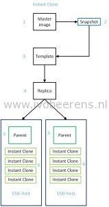
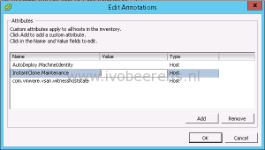
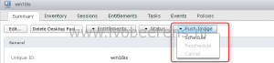

Horizon 7 introduced the Instant Clone feature leverages the vmFork technology introduced in vSphere 6.0 U1. With Instant Clone technology it is possible to clone and deploy a VDI desktop VMs in seconds. This is called the Just-In-Time Desktop.

Below is an overview how an Instant Clone VM is created:

1. **Master Image**. The Master Image or Golden Image is a Windows 7 or 10 optimized image that contains installed software such as the Horizon Agent for example.
2. **Snapshot**. A snapshot is taken of the master image.
3. **Template**. Per snapshot a linked clone template is created of the master image.
4. **Replica**. The replica is a full clone of the Template that is thin provisioned. The replica uses Content Based Read Cache (CBRC) and can be place on a specific datastore. This is the shared read disk for the desktop VMs.
5. **Parent**. Per ESXi host a parent VM is created. The parent  is powered on. From this Parent Instant Clones are created using vmFork.
6. **Instant Clone**. In a couple of seconds the the Instant Clone is created.  The Instant Clone will grow depending on the change rate but at logoff the Instant Clone is deleted and a new Instant Clone is created.

In the vCenter Server the following VM conventions are created:

- **Template**: cp-template-xxx
- **Replica**: cp-replica-xxx
- **Parent**: cp-parent-xxxx

**What to know about Instant Clones**

- vSphere 6.0 U1 or higher is needed for Instant Clones.
- For the Instant Clone feature Horizon Enterprise or Horizon Air in Hybrid-mode is needed.
- The Horizon View Storage Accelerator must be enabled.
- Instant clones VMs are always powered-on.
- Each time a user logs out of an Instant Clone, the desktop is deleted and a new desktop is provisioned and powered on.
- The Master image must be installed with Hardware Version 11.
- Uses ClonePrep for customization specification. All the Instant Clones uses a Single SID.
- Parent VMs are tied to VMware ESXi host they are on and cannot be migrated or powered off through the vSphere (web) Client. This prevents an ESXi host from entering maintenance mode. Follow [KB2144808](https://kb.VMware.com/selfservice/microsites/search.do?language=en_US&cmd=displayKC&externalId=2144808#.Vw_CDrBscIw.twitter) to put an ESXi host in maintenance mode.

- In the Horizon Agent, the Instant Clone feature must be enabled and the Composer must be disabled. It is not possible to enable both the View Composer and Instant Clone in the same Horizon Agent.
- Instant Clones is part of the Horizon Connection Server. So no additional infrastructure component is needed. If the Horizon Connection Server fails another Horizon Connection Server takes over.
- A Instant Clone Domain Admin is needed to add the Instant Clone to the Active Directory.
- Deploy applications and System updates by updating the parent image and create a new snapshot. With the new push image feature you can point to the new snapshot.

**What is supported**:

- Only Single-user desktops
- Only floating pools
- 1 vCenter Server maximum
- 1 VLAN only
- Windows 10 (32-64 bit) and Windows 7 SP1 (32-64 bit) as desktop Operating Systems
- Maximum number of 2 monitors with a resolution up to 2560x1600
- VMFS and Virtual SAN (VSAN) storage
- Scales up to 2000 Instant Clones per pool
- vMotion, DRS and HA

**What is not supported**

- Persona Management
- RDSH
- 3D Graphics (NVIDIA GRID), only limited SVGA support
- Virtual Volumes, VAAI, NFS or local datastores
- Disposable disk
- Dedicated pools
- Sysprep
- PowerCLI
- Persistent disks. If you need persistency use for example App Volumes with a writable disk and User Environment Manager (UEM).
- Storage vMotion of the Instant Clone

**Conclusion**

Horizon 7 includes a great new enhancement called "Instant Clones". Within seconds VDI desktop VMs can be deployed. There is no extra infrastructure components needed such as a Composer service. With this version of Instant Clones there are some caveats you need aware off before implementing in production. Further versions of VMware Horizon will improve Instant Clones to add more support.