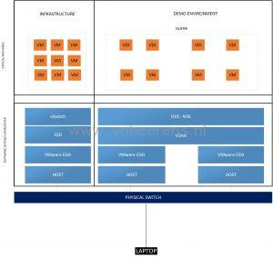
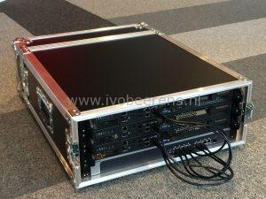
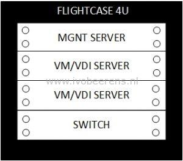
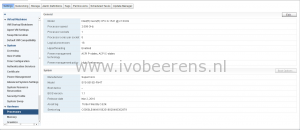
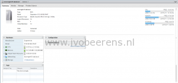
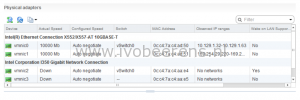

With my company I work for ([Ictivity](http://www.ictivity.nl/)), we decided to develop a mobile Software Defined Data Center (SDDC) and End User Computing (EUC) lab environment. This mobile lab environment will be used to demo the VMware SDDC and End User Computing (EUC) stack with integration of third party solutions. One of the reasons to use a physical lab environment instead of cloud services was flexibility and having no dependencies.

The past moths I've got asked what components we used to build this lab environment. So here is an quick overview. The environment logically looks like the picture below:

This environment contains three physical hosts with VMware ESXi installed and one switch. One ESXi host function as management host. On this management host the following software bits are installed:

- vSphere 6
- VSAN Witness
- NSX Manager
- Fortigate VMX
- vRealize components
- The End User Computing stack such as Horizon View, App Volumes, User Environment Manager and Identity Manager
- Veeam

The other 2 ESXi hosts function as demo cluster. On this 2-node cluster the following software bits are installed:

- vSphere 6
- Virtual SAN (VSAN) All Flash (AF) configuration
- NSX integration
- Windows 10l
- Windows Server 2012 R2

A laptop is used to connect to the lab environment.

**What component are used?** 

Some highlights of this lab are:

- 4U rackmount flightcase
- Mini-ITX motherboard
- Intel Xeon D-1541 single socket System-on-Chip 8 core processor
- 2 x 10 GbE Ethernet adapters
- Only SSD is used
- IPMI port

**Case**

The case is a robust custom made 19" 4U rackmount flightcase with a removable front and back. It has two wheels so you can carry it easily around. This case contains 3 servers and one switch.Here is a picture of the case including alle the hosts and the switch.

**Hosts**

The flightcase contains three SuperMicro SYS-5018D-FN4T 1U Rackmount hosts with the following hardware specifications:

- **Chassis**: SuperMicro 19" 1U with a 200W Gold level power supply. Optimized for Mini-ITX (SuperChassis SC505-203B)
- **Motherboard**: Super X10SDV-8C-TLN4F Mini-ITX board
- **Processor**: 1 x Intel Xeon D-1541 single socket System-on-Chip. This processor contains 8 cores with 16 threads (hypertreading)
- **Memory**: 4x DDR4 DIMM sockets (maximum 128 GB, 4 x 32GB DDR4 ECC  memory)
- **LAN**: 2 x 10GbE and 2 x 1 GbE and 1 x IPMI LAN port
- **Expansion slots**: 1 x PCIe 3.0 x16 slot and a M.2 PCIe 3.0 x4
- **Video**: Aspeed AST2400
- **USB**: 2x USB 3.0 and 4x USB 2.0

_Management host_

- **Memory**: 4 x 32GB = 128 GB
- **SSD**: 2 x Samsung PM863 MZ-7LM1T9E - SSD Enterprise - 1.92 TB - intern - 2.5" - SATA 6Gb
- **Disk**: Seagate Enterprise 6 TB disk (for backup)
- **USB Stick:** Sandisk Ultra Fit USB3 16 GB (for booting ESXi)

_Demo hosts_ 

Each host contains the following hardware:

- **Memory**: 2 x 16GB = 32 GB per server
- **SSD**: 1 x Intel P3500 SSD 1.2 TB PCIe 3.0 x4 (NVMe) and Samsung 950 Pro V-Nand M.2 PCI-e SSD 512GB
- **USB Stick:** Sandisk Ultra Fit USB3 16 GB (for booting ESXi)

_Switch_

- **Switch**: Netgear ProSafe Plus XS708E 8 x 10 Gbps +SFP slot

_Cables_

- 6 x UTP CAT6 0.50 cm cables
- 1 x UTP CAT6 5m
- 1 x UTP CAT6 10m

 

 

The two Intel X552/X557-AT NICs are not recognized by ESXi 6.5 and lower versions by default. To enable the Intel X552/x557 2 x 10GbE NICs download the Intel driver on the VMware website ([link](https://www.VMware.com/resources/compatibility/detail.php?deviceCategory=io&productid=39968&deviceCategory=io&details=1&partner=46&releases=274&keyword=10Gb&page=1&display_interval=10&sortColumn=Partner&sortOrder=Asc)). Extract the ZIP file and install the offline bundle by using the following command:

\[code language="PowerShell"\] esxcli software vib install -d /vmfs/volumes/datastore/driver/ixgbe-4.4.1-2159203-offline\_bundle-3848596.zip \[/code\]

With this mobile SSDC lab environment we archived the following benefits:

- Mobile and easy to carry around
- Flexibility to install the latest VMware SDDC and 3e party software
- No dependency
- Enough horsepower
- Low noise and power consumption
- Remote accessible from our datacenter
- IPMI and KVM support

