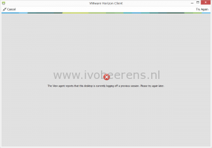

When building a new Horizon Environment, the logoff and refresh maintenance window takes a couple of minutes.

When a user is logging off from a Horizon VDI session the desktop refreshed in a floating pool. (A refresh action can be configured per pool). During the logoff and refresh window the desktop is in "maintenance mode" and the user is unable log in.

The following warning is displayed in the Horizon View Client when trying to connect:

> The View Agent reports that this desktop is currently logging off a previous session. Please try again later.

The new installed Horizon environment has the following products and versions installed:

- VMware vSphere 6.x
- Virtual SAN 6.2
- Horizon 7
- App Volumes 2.10
- User Environment Manager 9.0
- Sophos Antivirus for vShield
- Windows 7 desktop
- Windows 2012 RDS

After some troubleshooting, I disabled the "Sophos Antivirus for vShield" appliance per ESXi server. After disabling the appliance the VDI desktop logoff and refresh window was finished in a couple of seconds instead of a couple of minutes. So the problem has something to do with the virusscanner or vShield Endpoint. After digging deeper it was VMware Tools related. In April 2016 VMware Tools 10.0.8 was released that fixes performance problems with NSX and VMware vCloud Networking and Security 5.5.x.

After upgrading the VMware Tools version to 10.0.8 in the golden image the slow logoff and refresh was solved. Within a couple of seconds the user is now able to log off again to a fresh new VDI desktop.