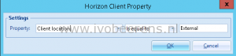

When designing a new Horizon View environment, one of the design phases is to identify what requirements there are when accessing (redirecting) devices in a Horizon View desktop of published app. In other words what redirection and devices are available and permitted in the VDI desktop or published app such as:

- USB devices
- Clipboard (copy/paste) redirection
- Client Drives Redirection (CDR)
- Printing redirection

For the most environments different requirements are needed when accessing devices from inside or outside the company.  Here is an example what redirection/devices are allowed when accessing from inside or outside the company:

<table style="width: 580px;"><tbody><tr style="height: 96px;"><td style="width: 106px; height: 96px;"><em>Endpoint</em>

<em>location&nbsp;</em></td><td style="width: 49px; height: 96px;"><strong>USB</strong></td><td style="width: 122px; height: 96px;"><strong>Client drive redirection</strong></td><td style="width: 109px; height: 96px;"><strong>clipboard</strong></td><td style="width: 104px; height: 96px;"><strong>printing</strong></td></tr><tr style="height: 48px;"><td style="width: 106px; height: 48px;"><strong>inside</strong></td><td style="width: 49px; height: 48px;">yes</td><td style="width: 122px; height: 48px;">yes</td><td style="width: 109px; height: 48px;">yes</td><td style="width: 104px; height: 48px;">no</td></tr><tr style="height: 72px;"><td style="width: 106px; height: 72px;"><strong>outside</strong></td><td style="width: 49px; height: 72px;">no</td><td style="width: 122px; height: 72px;">no</td><td style="width: 109px; height: 72px;">no</td><td style="width: 104px; height: 72px;">yes</td></tr></tbody></table>

In User Environment Manager (UEM) 9 there is a new functionality called "Smart Policies". With Smart Policies you can define what devices are allowed in the VDI desktop based on dynamic conditions such as:

- The endpoint location (inside or outside the company)
- Horizon Tags
- Desktop pool name
- Other View Client variables such as:

With the endpoint "Client location" condition it is possible to determine when accessing from inside or outside the company. When connecting through the internal Horizon View Connection server the "Client Location" gets the value _Internal_. When connecting through the Horizon View Security Server or Access Point the "Client location" condition get the value _External_. For the different requirements, 2 policies are needed, 1 for internal and 1 for external.

 

After defining the policy a condition needs to be set.

- For the internal policy: Property "Client Location" _is equal to_ Internal
- For the external policy: Property "Client Location" _is equal to_ External

**Example:**

After defining the conditions both policies are ready to use. In this blog post I showed the strength of using the new Smart Policies option in UEM9. Smart Policies requires UEM9 and Horizon 7 to function. 