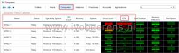
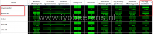

The success and effectiveness of a VDI environment depends on the End User Experience (UX). When the End User Experience isn’t good, users will complain and the VDI project will fail. So the ability to analyze, report and troubleshoot when a problem occurs is critical in a VDI environment. To get this insight I tested **ControlUp v6** and **VMware vRealize Operations for Horizon v6.3.** Both tools are tested against the following subjects:

- **Architecture**
- **Troubleshoot performance problems**
- **Reporting**
- **End User Experience monitoring**
- **Supporting End-Users**
- **Licensing**

The features of ControlUp and VMware vRealize Operations for Horizon are tested against a **VMware Horizon View 7** environment.

### Architecture

_ControlUp_

In the on-premises datacenter reside two components:

- **ControlUp Management Console.** This is a .NET Windows  application which connects to the vCenter Server/vSphere clusters and VDI desktops.
- **ControlUp Monitor Service.** This Windows service is responsible for alerting, reporting and uploading historical data to the Insight database which resides in the ControlUp Cloud.

The ControlUp installation is very simple. On a management server simply execute a single executable (ControlUpConsole.exe). It runs in memory, so there is no installation needed. For alerting and uploading data the ControlUp Monitor Service is needed. Here is an overview how a ControlUp hybrid (cloud and in-prem) infrastructure looks like:

On the left is the Enterprise Network displayed. This is the on-premises datacenter where the hypervisors and Horizon environment resides and where the ControlUp Monitor and Console are installed. There is a very minimal infrastructure needed for deploying ControlUp. All the backend components are hosted in ControlUp cloud that is  hosted on Amazon Web Services (AWS).

It's possible to have the backend  components installed on-premises with a special version of ControlUp if you have special compliance requirements. With this version everything runs on-premises.

VMware vRealize Operations for Horizon_

VMware vRealize Operations for Horizon is a monitoring solution that extends the capability of VMware vRealize Operations Manager to troubleshoot, monitor, and manage the health, capacity, and performance of VMware Horizon View environments. The architecture of vROps looks like:

The main components are:

- **VMware vRealize Operations (vROps)**. vROps can be deployed on Windows, Linux or when using the appliance.
- **VMware vRealize Operations Horizon management pack (PAK)**. After the vROps is installed and configured add the **VMware vRealize Operations Horizon management pack** to vROps.
- **vRealize Operations for Horizon broker agent**. On one Horizon View Connection Server install the agent and pair this with vROps Horizon adapter.
- **vRealize Operations for Horizon Desktop Agent**. In the Horizon View Agent enable this feature.

After installing and configuring these main components the gathering of statistics, events and performance data can begin. All the components are installed in the on-premises datacenter. Besides the VMware vRealize Operations Horizon management pack there are other management packs available that can be imported in vROps such as the Virtual SAN and NSX management pack. This improves the end-to-end visibility and monitoring.

### User Interface

_ControlUp_

When executing the ControlUp Management Console the following UI is displayed after adding the central vCenter server.

This is a real-time performance dashboard.

On the left the managed hypervisor(s), vCenter(s) and servers and desktops are listed. On the managed Windows desktops a lightweight agent is pushed.

The following dashboards are available:

- Folders
- Hosts
- Computers
- Sessions
- Processes
- Accounts
- Applications

You can easily search, filter, sort, group by,  customize and organize the columns that will be displayed in each dashboard.

_vROPS for Horizon_

The User Interface (UI) for vROps is accessible from the internet browser.

 

After logging-in there are Horizon specific dashboards available such as:

- Horizon Overview
- Horizon Help Desk
- Horizon Infrastructure
- Horizon User Sessions
- Horizon VDI Pools
- Horizon RDS Pools
- Horizon Applications
- Horizon Desktop Usage
- Horizon User Session details
- Horizon RDS Host Details
- Horizon End User Experience

These are the default dashboards but it is possible to create own personalized dashboards with widgets and metrics you need.

### **Troubleshoot performance problems**

To demonstrate performance troubleshooting with both products we use a Windows 10 VDI desktop and run the tool "Heavyload.exe" to generate 100% CPU utilization.

ControlUp

With ControlUp Management Console we can troubleshoot performance problems on hosts, computers and,-sessions in real-time and  identify the process that is causing the 100% CPU utilization.

 

vROPS for Horizon

With vROps we filter on "Percent Processor Time%", select the session and perform a manual "Get Desktop Processes".

The "Get Desktop Processes" task takes between 10-30 seconds to generate a list of process information per desktop. In ControlUp getting the processes list is in real-time. Besides identifying high CPU utilization other performance counters can be identified with both products.

### **Reporting**

_ControlUp Insights_

With ControlUp v5 ControlUp Insights was introduced. ControlUp Insights is historical reporting and analytics platform in the cloud. In v6 ControlUp Insights is extended with new reports. Each month new reports are added to the portal. The portal is accessible from the following URL:

- https://insights.controlup.com

When logging-in there are three main sections with a couple of sub-sections:

- **User Activity**
    - Session Count
    - Session Activity
    - Session Details
    - Session Resources
    - Logon Duration
    - Protocol Latency
- **System Health**
    - Computer Trends
    - Computer Statistics
    - Host Trends
    - Top Windows Errors
- **Application Usage**
    - App Usage Details
    - Citrix License Usage

Each section has a several reports with information about user activity, user experience, resource consumption, application activity, system health and license information. The reports are simple, interactive and good-looking.  In addition, where applicable, ControlUp Insights presents global benchmark values for performance and user experience metrics. These metrics are calculated based on anonymize metadata sent to ControlUp Insights from the customers that use this platform

Here are 4 examples reports of Insights:

   

The report data can be exported as CSV files.

_vROPS for Horizon_

There are several predefined Horizon reports that can be run or scheduled on regular basis. These reports provide information about remote desktop and application usage, desktop and application pool configuration details, and license compliance. Here are some examples:

   

The reports aren't as fancy and interactive as in ControlUp. The reports can be exported as CSV or PDF files.

### **End User Experience (UX) monitoring**

Besides performance metrics User Experience (UX) metrics are very important in a VDI and SBC environment.

_ControlUp UX metrics_

- **PCoIP Session bandwidth usage and latency**.
- **Desktop Load Time**.
- **Group Policy Load Time**.

- **Application Load Time**.

_vROps for Horizon_

- **PCoIP and Blast extreme protocol metrics**
- **Profile Load Time**
- **Shell Load Time**

Both products offer UI metrics. The **Application Load Time** is a new cool feature in ControlUp 6 that measures the time that it takes that an application become available for the end user. This is good indicator for the User Experience.

### **Supporting End-Users**

_ControlUp_

Besides monitoring and reporting there are other features built-in to support the End-users. The following screenshot show some of these features:

Script-Based Actions (SBA) allows the admin to extend ControlUp functionality. Scripts (either developed internally or by the community and then sanitized by ControlUp before being published), can be written using Batch, VBScript or PowerShell. These scripts can be used and executed on one or more target computers. This following SBA list the PCoIP bandwidth usage for example

The Application usage report lists the number of concurrent   instances and named users for the selected application.

This helps identifying who is using what application(s) and licensing applications.

The "top 10 Windows errors" report shows the most frequently occurring errors on all managed computers. If the error is known, it has a link with a possible solution and how to fix it.

All the errors are benchmarkend against other organizations.

_vROps for Horizon_

vROps focuses primarily on monitoring and reporting. So no other end-user supporting features are available as  in ControlUp. Other unique features are:

- Horizon VDI and application pool indicator metrics
- Besides PCoIP Blast Extreme protocol metrics are available in vROps for Horizon 6.3
- Management Packs.  There is a lot (VMware and third party) management packs available such as Virtual SAN and NSX. This improves the end-to-end visibility and monitoring with there own metrics.

### Licensing

_ControlUp_

ControlUp is available as Pro, Enterprise, or Platinum edition. The main differences between these versions are in:

- Insights retention data (1 Day for Pro, 1 Month for Enterprise, 1 Year for Platinum)
- Multi Tenancy Support (Enterprise and above)
- Multi AD support (Enterprise and above)

_vROPS for Horizon_

vROps for Horizon is licensed as:

- standalone product.
- Included in the Horizon Enterprise license

### **Conclusion**

In this blogpost I tried to give a impression of both products. ControlUp and VMware vRealize Operations for Horizon are both great products for monitoring and reporting on your Horizon environment.  Each products has several pros against the other such as:

**ControlUp:**

- Less infra structure is needed than vROps for Horizon.
- Simplicity of the product with an easy learning curve.
- Great tool for real-time troubleshooting. Process information is available is real-time.
- Pre-defined interactive reports available for troubleshooting and management information.
- Offers other functions such as: killing services, Script Based Actions, chatting, managing the file system and registry, application usage, top Windows events etc.

**VMware vRealize Operations for Horizon:**

- Besides the VMware vRealize Operations Horizon management pack, there are other management packs (VMware and third party) available that can be imported in vROps such as the Virtual SAN and NSX management pack. Such components become more and more common in a VMware Horizon environment. Adding these management packs improves the end-to-end visibility and monitoring.
- Ability to create personalized dashboards.
- vSphere and Horizon Infrastructure related counters such as VDI and Horizon applications pool information.

What product do I need for Horizon environment? This depends on your requirements, use case and what licenses you already have. For example when having a Horizon Enterprise license, vROps for Horizon is included. Even when having a vROps environment, ControlUp adds great value by it's unique features such as the interactive ControlUp Insights reports and complement vROps.