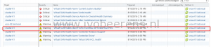
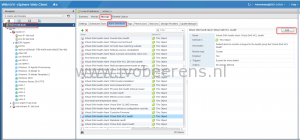
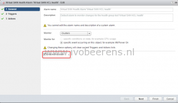

When using PCIE/NVMe SSDs in the capacity layer of Virtual SAN, the SSDs are generating a warning for the “Hardware Compatibility – SCSI Controller on Virtual SAN HCL” health check, even when the devices are on the Virtual SAN HCL.

The "Hardware Compatibility - SCSI Controller on Virtual SAN HCL**"** health check cannot detect the PCIE/NVMe SSDs because they do not use standard I/O controllers.

To disable the HCL health check alarm use these simple steps:

- In the vCenter Web Client top level, navigate to Manage and select "**Alarm Definitions**"
- Navigate to the alarm and select **Edit**

- Deselect the "**Enable this alarm**" checkbox and click on Finish

Another use case is to disable the HCL health check(s) in non-production lab environments that use Virtual SAN with hardware that is not certified.