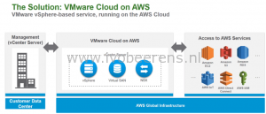
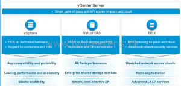
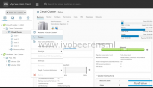
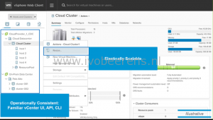
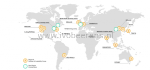
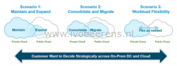

VMware and Amazon Web Services (AWS) will partnering together to bring a new a VMware vSphere-based service, running on the AWS Cloud, that will make it easier and faster to run applications, across a hybrid cloud environment.

It's called the "VMware Cloud on AWS". The infrastructure looks like:

The VMware Cloud on AWS includes the following components:

- vCenter. The environment is managed by a vCenter that is running in the cloud or on-premises.
- ESXi on dedicated hardware in AWS Cloud (no nesting is used!).
- Virtual SAN offers shared storage with replication and DR orchestration.
- NSX for spanning on-premises and cloud using advanced network and security services.

This service is delivered, operated, sold and supported by VMware. Low level infrastructure management such as installing patches on ESXi servers and upgrading the vCenter is done by VMware.

The vSphere Web Client is based on HTML5 protocol. In the Web Client the on-premises datacenter and VMware AWS cloud is listed (single pane of glass).

Other CLI tools such as PowerCLI can be used against the environment.

When you want to resize a on-premises cluster you need to buy extra hardware (server, network and disk capacity) to resize the cluster.  In the AWS datacenter you can simple select the "resize" option.

This option demonstrates the flexibility and elastic scalability of the AWS cloud.

Below is the location map of the AWS regions that support the VMware Cloud datacenters:

The on-premises datacenter can be connect to the AWS datacenters using IPsec tunnels or direct connect to create a hybrid cloud.

Some use cases are:

- Maintain and Expand the to the VMware Cloud on AWS
- Consolidate and migrate to the VMware Cloud on AWS
- Workload Flexibility between the on-premises an AWS cloud

During VMworld Europe 2016 more information wil be available on the VMware Cloud on AWS partnership.