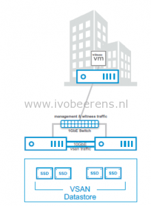
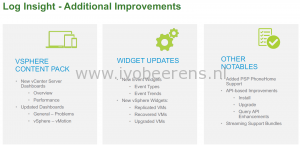

Today at VMworld Europe 2016, **vSphere 6.5** is announced.

**Update**: November 15, 2016 vSphere 6.5 is GA.

In this blog we highlight some major feature announcements on the following products and technologies:

- vCenter Server Appliance (VCSA)
- Virtual SAN (VSAN)
- Host Profiles
- Auto Deploy
- vSphere Security
- vSphere Fault Tolerance (FT)
- vSphere DRS
- Storage IO Control (SIOC):
- Content Library
- vSphere Operations Management
- vRealize Log Insight
- PowerCLI

Here is an overview of the new feature highlights in vSphere 6.5:

**vCenter Server Appliance (VCSA):**

- **VMware Update Manager (VUM) for the vCenter Server Appliance (VCSA)**. VUM is integrated by default in the VCSA and uses the internal embedded database.
- **Native High Availability for the vCenter Server Appliance (VCSA only**). Create a High Available VCSA environment and eliminate the single point of failure. The HA configuration is active/passive with a witness in between and looks like:

- **Improved Appliance Management**.
    - Monitoring: Built in monitoring for CPU, memory and network interface
    - vPostgres database visibility
    - Remote Syslog configuration
    - vMon: Enhanced watchdog functionality. Watch the vCenter Server services
    - Client Integration Plugin (CIP) for the vSphere Web Client is no longer required anymore
    - vSphere Management Interfaces such as the vSphere Client (HTML 5 Web Client):

-  **Native Backup & Restore of the VCSA**. Removes dependency on 3rd party backup solutions. Easily restore the backup to a new VCSA. The following protocols are supported:
    - HTTP(S)
    - SCP
    - FTP(S)
- **VCSA Installer improvements**:
    - Run the VCSA depolyment installeren on Windows, Mac and Linux
    - The installer supports install, upgrade, migrate and restore
- **VCSA Migration**: Migrate from vCenter 5.5 or 6.0 tot 6.5 with the options to migrate the:
    - Configuration only
    - Configuration, events and tasks
    - Configuration, events, task and performance metrics

**Host Profiles:**

- **Manageability**
    - Editor enhancements: filter and favorites
    - Bulk edit host customization using CSV files
    - Copy settings between profiles
    - Streamlined remediation wizard
- **Operational**
    - Pre-check proposed changes
    - Detailed compliance results
    - DRS integration - rolling remediation
    - Parallel remediation

**Auto Deploy:**

- **Operational**
    - GUI for Image Builder, Deploy rules
    - Interactive deployment of new hosts
    - Post-boot scripts for advanced configs
    - EUFI and IPv6 support
- **Performance and Resiliency**
    - Scalabillity improvements 300+ hosts
    - VCSA HA & backup support
    - Round robin reverse proxy caching
    - Backup and restore state with PowerCLI

**vSphere Security**:

- **Enhanced Logging.**  Expose vCenter events to a Syslog server (such as vRealize Log Insight) without turning on verbose logging in vCenter Server and blowing up the database.
- **VM Encryption.**  Encrypt the VM virtual disk(s) and VM files  by using an encryption policy. The VM guest is not modified. The encryption is done at the hypervisor level.
- **Encrypted vMotion**. Virtual  Machine vMotion data is encrypted during a vMotion on a per VM basis.
- **Secure Boot for ESXi and Virtual Machines**. Requires hardware that support EUFI and a secure Boot firmware.

**vSphere HA**:

- **Admission Control.** Simplified configuration workflow. It automatically calculates the % of resources to reserve.
- **Restart Priorities**: Additional restart priorities added such as highest and lowest for more flexibility and greater control.
- **HA Orchestrated Restart.**  Enforce VM to VM dependency chains. This is great for multi-tier applications the require VMs to restart in a particular order.
- **Proactive HA.** vCenter plugin that connects to the hardware vendor monitoring solution (Dell Open Manage, HP Insight Manager or Cisco UCS). When there is for example a memory failure detected by the hardware vendor monitoring tools, the VMs from that hosts are migrated using vMotion to another hosts.

**vSphere Fault Tolerance (FT)**:

- **Improved DRS integration**. DRS will better place the secondary VM
- **Performance Improvements**:
    - Host level network latency reduction. Allows to run more applications with FT.
    - Multi-NIC Aggregation. It is possible to pack more NICs like (vMotion for FT) for better performance.

**vSphere DRS:**

- Network-Aware DRS. Adds network bandwidth calculations in DRS. This avoids an over-subscribing host network link.
- Advanced DRS Policies exposed in the UI.

**Storage IO Control (SIOC)**:

- Setting IO limits in Storage Policy Based Management (SPBM) and apply the policy to the VMs.

**Content Library**:

- Mount an ISO file from the Content Library
- OS Customization during VM deployments from the library.
- Update an existing template with a new version
- Optimized HTTP sync between vCenter Servers

**Virtual SAN 6.5**

- **2-node Direct Connect and Witness traffic separation**. Ability to connect two nodes directly using ethernet cables. Stretchen VSAN with Direct Connect is not supported at the moment. Benefits:
    - Reducing costs (no need for 10 GbE switches).
    - Simplicity.
    - Separate VSAN data traffic from witness traffic.

- **Licensing**:
    - The VSAN standard license includes the All-Flash option
    - New VSAN advanced for ROBO licensing
- **Virtual SAN iSCSI access.** iSCSI access is built for supporting MSCS with shared storage and physical workloads that needs to have storage. There is no support in this release to targeting the VSAN storage to other ESXi clusters.

**vSphere Operations Management:**

- vSOM is a combines of vSphere Enterprise plus with vRealize Operations Manager standard edition as a single offer.
- New Home dashboard

- New DRS Dashboard
- Update Workload Utilization Dashboard

- Other improvements are:

**vRealize Log Insight version 4**

- New Clarity User Interface. This new interface looks much better  and cleaner

- Alert enhancements

- Other Enhancements

**PowerCLI**

- No more snapins are used, it's now fully module based.

- Module improvements. Here are some examples:
    - Added cross vCenter storage vMotion support
    - The VSAN module is extended with 13 additional cmdlets
    - **Complete new Horizon View module**. It is now possible to run from it from anywhere, in earlier releases it was only possible to run it from a Connection Server. On this release are only 2 cmdlets available (Connect and Disconnect). Once connected you can use the API.
- Microsoft open sourced PowerShell. It possible to run PowerShell from Windows, a MAC and Linux. VMware will release a PowerCLI Core version as fling.
- The vSphere Management Assistent is being deprecated. Use the vCLI. It has support for different OSes. Use vCLI for:
    - ESXCLI commands
    - vicfg- commands
    - Other Perl Commands
    - Datacenter CLI

**Conclusion**

vSphere 6.5 is packed with great new features. My top is new features are:

- HTML5 client
- vCenter Server Appliance (VCSA) with Update Manager integration
- vCenter Server Appliance (VCSA) native High Availability
- Virtual SAN (VSAN) Direct Connect
- A new PowerCLI module for Horizon View