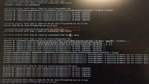

In the vSphere Web client an orphaned vSAN object was listed named:

```
/vmfs/volume/vsanuuid  
```

[](images/1.png)

From the vSphere Web Client you cannot manage orphaned vSAN objects . To check and fix orphaned vSAN objects, the Ruby vSphere Console (RVC) is needed.  The 'vsan.check\_state' command checks if VMs and Virtual SAN objects are valid and accessible.

After logging in the RVC `rvc administrator@vSphere.local@localhost`, execute the `vsan.check_state -r` command at the cluster level:

```
/localhost/dc-beerens-01/computers/CL-01/vsan.check_state -r
```

The "-r" parameter refreshes the VMX and registers the VMs.

[](images/2.jpg)

After running the `vsan.check_state -r` command, the vSAN object is listed as VM back again in the vSphere Web Client.