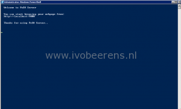
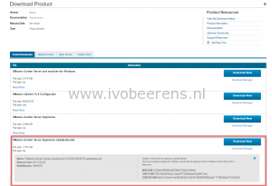
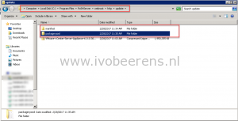
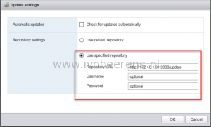
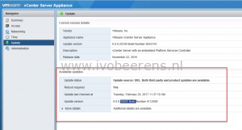
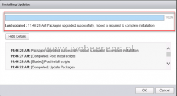

In this blog post I highlight how to patch or update a single vCenter Server Appliance (VCSA) without having an internet connection. The patch will be stored on a temporarily web server that is installed on a Windows machine. In this example we update the vCenter Server Appliance version from 6.0 Update 2 to 6.0 Update 3 build 5050593.

Here are the main steps:

1\. On a Windows machine install a temporarily web server to host the VCSA patch. As web server "Posh Server" will be used. This is a small PowerShell web server. Download the Posh Server and install it on a Windows box. After the installation (use the default settings) open PowerShell (As Administrator) and execute the following commands:

``` 
Set-Executionpolicy unrestricted
```

Type "y" to confirm. Go to the "_C:\\Program Files\\PoSHServer_" folder.

```
Import-Module PoSHServer Start-PoshServer -Port 9000
```

The Posh web server is started and listens on port 9000

[](images/PoshStart.png)

2\. Download the patch (zip file)  from the VMware website.

[](images/Patch.png)

Extract the patch on the Windows machine in the web server folder under `C:\Program Files\PoSHServer\webroot\http\update`. Besides the patch file(ZIP), two folders are extracted (manifest and package-pool).

[](images/Posh-Create-Directory.png)

2. Before upgrading make sure you have a backup copy of the VCSA!

3\. Open the vCenter Server Appliance web interface `https://VSCA-IP:5480`. Go to the update tab and click settings, select use "Specified Repository". Enter as location of the web server and update folder. In this example we use:

```
http://IP-web-server:9000/update
```

[](images/1-1.png)

Click OK, check updates and use the "Check Repository" option. (**tip**: make sure to disable the proxy configuration in the VCSA)

[](images/2-1.png)

4\.The update displayed in available updates. Install the update.

[](images/4-1.png)

When the update is finished, click OK and reboot the appliance.

5\. After the reboot check the version and build version of the new patch.