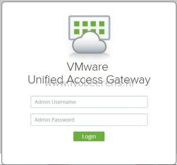
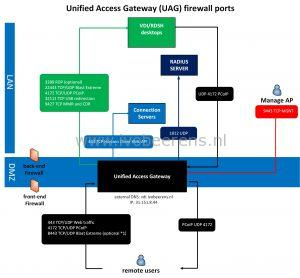
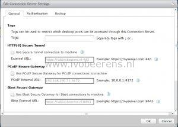
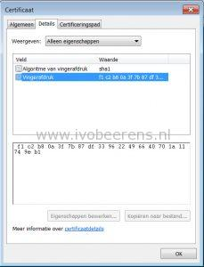
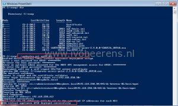

In 2013 I created a blog post with some tips for implementing a VMware Horizon View Security Server ([link](https://www.ivobeerens.nl/2013/03/05/tips-for-implementing-a-vmware-horizon-view-security-server/)). Now the Unified Access Gateway (UAG) is replacing the VMware Security Server. So it’s time for a new blog post with some implementation tips about VMware Access Point / Unified Access Gateway (UAG). Here’s an overview of the tips:
- The Unified Access Gateway (UAG) provides secure access to the following environments:
    - VMware Horizon desktops and applications
    - VMware Identity Manager
    - VMware AirWatch or VMware Workspace ONE per-app tunnels and tunnel proxy
    - VMware Content Gateway service to allow VMware Content Locker access to internal file shares and Microsoft SharePoint

[](images/inlogscherm.jpg)

- In version 2.9 Access Point is renamed to Unified Access Gateway (UAG)
- UAG is included in the Horizon standard, advanced and enterprise license
- The use cases listed above can be mixed on the same UAG or separated on multiple UAGs
- UAG 2.9 supports Horizon 6.2.3, 6.2.4 and 7.1.0
- UAG includes some improvements (such as blast Extreme) that are not available in the Horizon Security Server
- UAG is deployed in the DMZ and replaces the Horizon Security Server (Windows based)
- UAG is packaged as an OVF.  It's a hardened Linux appliance based on SUSE Enterprise Linux. So there no need for Windows OSes in the DMZ which improves security!
- Hardware specifications for the UAG are:
    - 2 vCPU
    - 4 GB memory
    - 20 GB harddisk
    - 1,2 or 3 Network adapters
- Create an IP pool before deploying the UAG
- Below is an overview of the VMware UAG firewall ports configuration:

[](images/Access-Point-firewall-ports-1.jpg)

The documentation about the the firewall ports can be found [here](http://pubs.VMware.com/accesspoint-29/index.jsp?topic=%2Fcom.VMware.access-point-29-deploy-config.doc%2FGUID-F197EB60-3A0C-41DF-8E3E-C99CCBA6A06E.html).

(**\*1**) When using Blast Extreme over port 443, port 8443 is not needed

- The administration user interface (UI) can be used to set up and manage the Unified Access Gateway environment. To access to the management interface go to: **https://ipaddress:9443/admin**
- Upgrading UAG is not supported. Install a new appliance. It's highly recommend to create a PowerShell script for the deployment that can be used everytime when installinging a new UAG.
- When deploying UAG using PowerShell, download the latest deployment scripts, [link](https://communities.VMware.com/docs/DOC-30835)
- The following certificates can be used:
    - Single-Server Name Certificate
    - Subject Alternative Name (SAN)
    - Wildcard Certificate
- Convert the certificate into PEM-format files for the certificate chain and the private key, then convert the .pem files to a one-line format that includes embedded newline characters
- If your certificate is in PKCS#12 (.p12 or .pfx) format, or after the certificate is converted to PKCS#12 format, use Openssl to convert the certificate to .pem files
- There is NO need to pair Horizon Connection Servers with Access Point or UAG. Uncheck the boxes in the Connection Server:

[](images/Connection-settings.jpg)

- Before configuring Radius authentication, first test if PCoIP and Blast access works:
    - Test a native Horizon Client using PCoIP. Test a native Horizon Client using Blast. Test the HTML Access Client (which also uses Blast)
- Some browsers have problems with Client HTML access ([link](https://communities.VMware.com/thread/553631)). To solve this problem change the checkorigin property.
    - On each Horizon Connection Server
    - Add a line in the "locked.properties" file (C:\\Program Files\\VMware\\VMware View\\Server\\sslgateway\\conf)
    - checkOrigin=false
    - Save
    - Restart the VMware Horizon View Connection Server service.

**PowerShell example**

I prefer the create a PowerShell script for the deployment of the UAG. This script deploys a single UAG with a single NIC and provide secure access to the Horizon View environment. The certificate will be generated automatically and is self-signed (in production environments use an signed certificate).

When re-deploying an UAG with PowerShell there is no need to manually remove the appliance. When the config is the same the old appliance is automatically removed.

Before using PowerShell make sure the following requirements are met, [link](http://pubs.VMware.com/accesspoint-29/index.jsp#com.VMware.access-point-29-deploy-config.doc/GUID-3A409EB7-C889-4F1D-8A60-896A78F0C3F2.html).

PowerShell script:
```
[General]
#
# UAG virtual appliance unique name (between 1 and 32 characters).
# If name is not specified, the script will prompt for it.
#
 
name=UAG01
 
#
# Full path filename of the UAG .ova virtual machine image
# The file can be obtained from VMware
#
 
source=C:\temp\euc-access-point-2.9.0.0-5202536_OVF10.ova
 
#
# target refers to the vCenter username and address/hostname and the ESXi host for deployment
# Refer to the ovftool documentation for information about the target syntax.
# See https://www.vmware.com/support/developer/ovf/
# PASSWORD in upper case results in a password prompt during deployment so that passwords do not need
# to specified in this .INI file.
# In this example, the vCenter username is administrator@vsphere.local
# the vCenter server is 192.168.0.21 (this can be a hostname or IP address)
# the ESXi hostname is esx1.myco.int (this can be a hostname or IP address)
#
target=vi://administrator@vsphere.local:PASSWORD@192.168.250.30/dc-beerens-01/host/mgnt
 
#
# vSphere datastore name
#
 
ds=NFS-01
 
#
# vSphere Network names. A vSphere Network Protocol Profile must be associated with every referenced network name. This specifies
# network settings such as IPv4 subnet mask, gateway etc.
#
 
netInternet=dmz-vlan100
netManagementNetwork=dmz-vlan100
netBackendNetwork=dmz-vlan100
deploymentOption=onenic
ip0=192.168.250.32
netmask0=255.255.255.0
dns=192.168.250.2
#syslogUrl=syslog://server.example.com:514
 
#
# Setting honorCipherOrder to true forces the TLS cipher order to be the order specified by the server. This can be set on
# UAG 2.7.2 and newer to force the Forward Secrecy ciphers to be presented first to improve security.
#
 
honorCipherOrder=true
 
[Horizon]
 
#
# proxyDestinationUrl refers to the backend Connection Server to which this UAG appliance will connect.
# It can either specify the name or IP address of an individual Connection Server or of a load balanced alias to connect
# via a load balancer in front of multiple Connection Servers.
#
 
proxyDestinationUrl=https://192.168.250.71
 
#
# proxyDestinationUrlThumbprints only needs to be specified if the backend Connection Servers do not have
# a trusted CA signed SSL server certificate installed (e.g. if it has the default self-signed certificate only).
# This is a comma separated list of thumbprints in the format shown here.
#
 
proxyDestinationUrlThumbprints=sha1:f1 c2 b8 0a 3f 7b 87 df 33 96 22 49 66 40 70 1a 11 74 9e b1
 
tunnelExternalUrl=https://vdi.ivobeerens.nl:443
blastExternalUrl=https://vdi.ivobeerens.nl:443
 
#
# pcoipExternalUrl must contain an IPv4 address (not a DNS name)
#
 
pcoipExternalUrl=31.151.8.45:4172
```

- name_: The name of the Unified Access Gateway (UAG)
- source_: The location of the OVF file
- target_: Specifies the vCenter Server information and target ESX host.
- ds_: datastore to deploy the UAG
- vSphere Network names_: This section contains the network settings such as:
    - Portgroup
    - IP Address
    - Subnetmask
    - Amount of NICs
    - DNS server(s)
- honorCipherOrder_: This allows forward secrecy ciphers to be presented first in the cipher list to improve security.
- proxyDestinationUrl_: URL representing the Horizon backend server (internal Connection server)
- proxyDestinationUrlThumbprints_: This contains the thumbprint of the Connection Server



- tunnelExternalUrl_: URL used by Horizon Clients to connect the secure tunnel to this UAG appliance
- blastExternalUrl_: URL used by HTML Access Clients to connect to this UAG appliance
- pcoipExternalUrl_: URL used by Horizon Clients to connect using PCoIP to this UAG appliance (external IP address)

[](images/PowerShell.jpg)

When the UAG deployment successfully executes other configuration (UI or PowerShell) options can be added such as:

- Trusted certificates
- Radius authentication
- Identity Manager