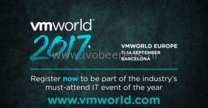
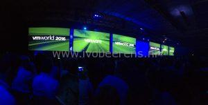
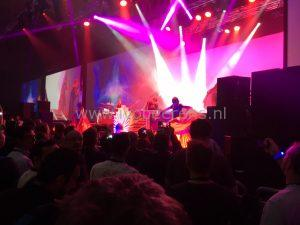
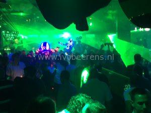

In less then 54 days I’m attending VMworld Europe in Barcelona again. My first VMworld visit was in Cannes (France) in 2009. This year I visit VMworld with two other [Ictivity](https://www.ictivity.nl/) (Dutch VMware partner) colleagues.

Here are a couple of reasons why I'm so excited to visit VMworld Europe:

#### **1\. General sessions**

In the general sessions the vision, future directions and key announcements will be presented.

Key focus areas for the general sessions are:

- Transform your data center into real private clouds
- Extend into public clouds for more freedom and control
- Enable a new digital workforce to with technology
- Transform your security architecture

#### **2\. Breakout sessions**

Each day I Pick a couple of sessions with a maximum of 3. The session choice is based on content and the presenter. Each session is recorded so you can watch it anytime after VMworld.  The session builder can be found here, link.

#### **3\. Solution Exchange**

The Solution Exchange is packed (over 130) with vendors who support VMware.  Learn more about the latest solutions and technologies from these vendors.

#### **4\. Hands-on Labs**

During VMworld I visit the hands-on labs a couple of times. With the hands-on labs you're able to discover  one or more product(s) in short time. I really like the quality of the hands-on labs. After VMworld the new labs will be available ([link](http://labs.hol.VMware.com/HOL/catalogs/)).

#### **5\. Catch up with people**

VMworld is a great place to meet friends, share knowledge and network with other people. Share and extend you're knowledge!

#### **6\. Barcelona**

Barcelona guarantees great weather, food and culture. Make some spare time to explore Barcelona.

#### **7\. Parties**

Each day one or more vendor parties are organized. Pick some and have a great time. Here is overview of some parties (when more information is available the list will be updated):

<table style="width: 991px;"><tbody><tr><td style="width: 297px;"><strong>Event</strong></td><td style="width: 198px;"><strong>Date</strong></td><td style="width: 194px;"><strong>Registration</strong></td><td style="width: 230px;"><strong>Description</strong></td></tr><tr><td style="width: 297px;">vRockStar</td><td style="width: 198px;">Sunday 10 September</td><td style="width: 194px;">&nbsp;Link</td><td style="width: 230px;"></td></tr><tr><td style="width: 297px;">Partner Exchange reception</td><td style="width: 198px;">Monday 11 September</td><td style="width: 194px;"></td><td style="width: 230px;"></td></tr><tr><td style="width: 297px;">vExpert Party</td><td style="width: 198px;">Tuesday 12 September</td><td style="width: 194px;">Invite only</td><td style="width: 230px;"></td></tr><tr><td style="width: 297px;">VMware BeNeLux</td><td style="width: 198px;">Tuesday 12 September</td><td style="width: 194px;"></td><td style="width: 230px;"></td></tr><tr><td style="width: 297px;">Veeam Party</td><td style="width: 198px;">Tuesday 12 September</td><td style="width: 194px;"></td><td style="width: 230px;"></td></tr><tr><td style="width: 297px;">VMworld Customer Appreciation Party</td><td style="width: 198px;">Wednesday 13 September</td><td style="width: 194px;"></td><td style="width: 230px;">Included in a full conference pass. The headlinder this year is the Kaiser Chiefs! Last year the band Empire of the sun was the main act.</td></tr></tbody></table>

 

This year the headline of the VMworld Europe party will be the Kaiser Chiefs! A complete list of VMworld Europe gatherings can be found here, [link](https://docs.google.com/spreadsheets/d/1klKROM_fABDDoIKOokdSvPPwT4uuqAwHDAgEwjoA57k/pubhtml?gid=1&single=true).

VMworld is an awesome experience!  More information can be found here:

- When: September 11 - 14  2017
- Where: BARCELONA , FIRA GRAN VIA
- Registration: [link](https://reg.rainfocus.com/flow/VMware/vmworldeu17/reg/account?src=so_590b8a703e237&cid=70134000001K7Xj)

Special thanks to the vExpert team for providing me a bloggers pass! See you at VMworld Barcelona!