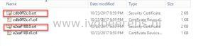

When trying to deploy an OVA/OVF with the vSphere Web Client the following error is displayed:
> The operation failed for an undetermined reason. Typically this problem occurs due to certificates that the browser does not trust. If you are using self-signed or custom certificates, open the URL below in a new browser tab and accept the certificate, then retry the operation.

This error occurs with vSphere 6.5 because the certificates are not trusted. The self-signed certificates are used and are not added to the trusted root certification store.

To deploy a OVF/OVA to the vCenter Server appliance trusted root CA must be added to the certificate store. The following steps will work with Chrome and Internet Explorer:

- Open the vCenter URL: `https://vcenter-FQDN`

- Select the "Download trusted root CA certificates" and save the archive(ZIP) file
- Extract the archive (ZIP)

- Start – Run – MMC
- File – Add Snap-ins – Certificates – Computer Account – Local computer
- Open Trusted Root Certification Authories - Certificates
- Import the two \*.crt certificates

- Close the browser and re-open the browser and navigate to the vCenter Server using the FQDN.
- Now the URL is marked as secure (green lock) and you're able to import the OVA/OVF

