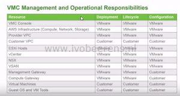
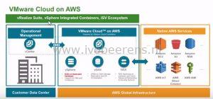

At VMworld 2017 in Las Vegas VMware Cloud on AWS (VMConAWS) is announced. This partnership between VMware and AWS makes it possible to create a VMware Software Defined Datacenter (SDDC) in Amazon Web Services (AWS). In this blogpost I highlight some information on "What is the VMware Cloud on AWS".

- VMware Cloud on AWS is a cloud service that is fully configured and will be provisioned, operated and maintained directly by VMware. VMware handles all patching and updates. As customer you manage the VMs, not the platform.

- The following VMware products are included in VMware Cloud on AWS offering (compute, storage and networking):
    - vSphere ESXi on dedicated bare-metal hardware with support for VMs and containers
    - vCenter Server for management
    - vSAN All Flash storage
    - NSX for spanning on-premises and Cloud, advanced networking and security
    - vRealize products are NOT included in this offering but can integrated
- In order for the on-boarding process to complete successfully there is a strict requirement that every organization be linked to an AWS account. Any services consumed within AWS will be billed through this Amazon account, while SDDC consumption will be billed through VMware.
- The minimal purchase is cluster of 4 ESXi hosts. The maximum cluster size is 16 hosts.
- It's a dedicated platform that is not shared with other customers.
- You can add additional on-demand hosts and also remove hosts on-demand down to 4 ESXi hosts.
- Each ESXi host is has:
    - 2 pCPU sockets, 18 cores per socket = 36 cores total and 72 with hyper-treading
    - 512 GB RAM
    - 14 TB NVMe RAW capacity storage (around 10 TB of usable storage per host). In a 4 node cluster 21 TB of usable storage is available with FTT=1 (RAID=1) protection
    - The vSAN datastore is configured as a single datastore
    - 10 Gbps+ (ENA)
- To extend storage you need to add extra ESXi hosts
- The following VMware features are enabled:
    - vSphere HA,
    - vMotion,
    - DRS
    - Elastic DRS
- Cluster functions are configured by VMware

- It's possible to connect the on-premises VMware datacenter with VMware Cloud on AWS by using for example a L3 IPsec VPN and enable Hybrid Link Mode (HLM) between the two vCenter servers for single pane of glass hybrid cloud management.
- In the future a Amazon direct connect is supported (1 Gbps or more)
- There no need for NSX and vSAN in the on-premises datacenter.
- Some use cases are:
    - Disaster Recovery (DR) and Backup.
    - Test and Development
    - Extend the on-premises data centers to the cloud with a consistent operational model, retaining your familiar VMware tools, policies and management.
    - New application development and test that access native AWS services
    - Burst capacity
- On the moment the are two consumption models available:
    - On-demand/hourly consumption model
    - 1 or 3 years reserved model.
    - More on pricing can be found here, [link](https://cloud.VMware.com/vmc-aws/pricing)
- The initial release has support for cold migration. Cross cloud vMotion will be available in a future release
- VMware Cloud on AWS is based on open API's.
- Currently VMware Cloud on AWS is only available in AWS US West (Oregon) region. Other regions will follow in 2018.
- You can bring your own licenses because it's a dedicated platform.

More information:

- VMware Cloud on AWS website, [link](https://cloud.VMware.com/vmc-aws)
- VMware Cloud on AWS: Live End to End Demo, [link](https://www.youtube.com/watch?v=JI_BUvgfXRg&feature=youtu.be)
- VMware on AWS from a Veeam perspective, [link](https://vzilla.co.uk/vzilla-blog/VMware-aws-will-look-veeam-perspective)
- VMware Cloud on AWS pricing versus on-premises vSphere, [link](http://searchservervirtualization.techtarget.com/tip/VMware-Cloud-on-AWS-pricing-versus-on-premises-vSphere)