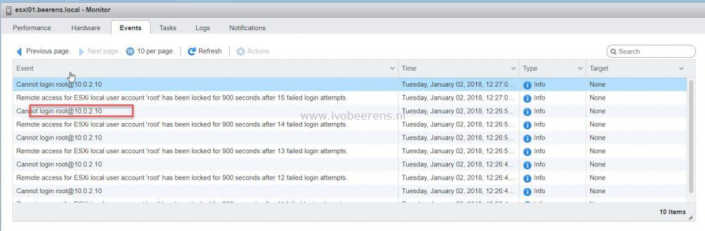

When starting one of my VMware ESXi 6.5 lab hosts I was unable to login using the vSphere Host Client. I tried to make an SSH session to the host but got an “Access Denied” message.

Using the Direct Console Interface (DCUI) I was able to login using the root account. In the log folder (under /var/log) I found that the root account is locked because of many failed attempt by investigate the following log files:

vobd.log

```
2018-01-02T10:57:00.003Z: [GenericCorrelator] 5612887277us: [vob.user.account.locked] Remote access for ESXi local user account 'root' has been locked for 900 seconds after 58 failed login attempts.
2018-01-02T10:57:00.003Z: [UserLevelCorrelator] 5612887277us: [vob.user.account.locked] Remote access for ESXi local user account 'root' has been locked for 900 seconds after 58 failed login attempts.
2018-01-02T10:57:00.003Z: [UserLevelCorrelator] 5612887502us: [esx.audit.account.locked] Remote access for ESXi local user account 'root' has been locked for 900 seconds after 58 failed login attempts
```

auth.log

```
2018-01-02T11:02:08Z sshd[117700]: Connection from 192.168.249.23 port 63449
2018-01-02T11:02:09Z sshd[117701]: pam_tally2(sshd:auth): user root (0) tally 72, deny 5
2018-01-02T11:02:14Z sshd[117700]: error: PAM: Authentication failure for root from 192.168.249.23
2018-01-02T11:02:14Z sshd[117710]: pam_tally2(sshd:auth): user root (0) tally 73, deny 5
```

By default the ESXi 6.x password requirements for lockout behavior are:

- A maximum of ten failed attempts is allowed before the account is locked
- Password lockout is active on SSH and the vSphere Web Service SDK
- Password lockout is not active on the Direct Console Interface (DCUI) and the ESXi Shell

To view the number of failed login attempt use the following command:

```
pam_tally2 --user root
```

In my example the there were 58 failed root login attempts:

```
Login Failures Latest failure From root 58 01/02/18 10:56:59 unknown
```

The clear the the password lockout use the following command:

```
pam_tally2 --user root --reset
```

After this command I was able to login the vSphere Host Client. In the vSphere Host Client I found the VM that is causing the root account lockout:

[](images/1.jpg)

The VM was monitoring the vSphere ESXi host with the wrong root password. After changing the password the account lockout problem was solved.