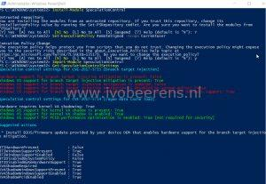

You probably heard about the two massive security flaws: Spectre and Meltdown ([link](https://meltdownattack.com/)). These security flaws allow attackers to access “secure” data by compromising privileged processor memory from major manufacturers, including Intel, AMD, and ARM. So the most CPUs are affected by Spectre and Meltdown security flaws! In this blogpost I highlight what to do in VMware environments.

 

Last Updated:

- _**Januari 14, 2018.**_ All the patches associated with [VMSA-2018-0004](https://www.VMware.com/us/security/advisories/VMSA-2018-0004.html) have been pulled back from the online and offline portal. Intel has notified VMware of recent sightings that may affect some of the initial microcode patches that provide the speculative execution control mechanism (Intel Sightings) for a number of Intel Haswell and Broadwell processors. [Link](https://kb.VMware.com/s/article/52345)
- _**Januari 17, 2018.**_ LoginVSI gives a free license to all companies who are in need of performance testing their VMware Horizon VDI environment regarding meltdown and spectre security patches. This special license will be valid until March 31, 2018, and offers unlimited users, unlimited locations, and includes all standard user workloads. More information can be found here [Link](https://www.loginvsi.com/use-cases/spectre-meltdown).
- _**Januari 22, 2018.**_ VMSA-2018-0002.3 updated. Updated security advisory after release of ESXi 5.5 patch ESXi550-201801301-BG that has mitigation against both CVE-2017-5753 and CVE-2017-5715 on 2018-01-22. This patch does NOT include the unstable microcode mentioned in KB52345.
- **Februari 3, 2018**. Added the VMware Performance Impact for CVE-2017-5753, CVE-2017-5715, CVE-2017-5754 KB. [Link](https://kb.VMware.com/s/article/52337)
- **Februari 8, 2018.** VMware Virtual Appliance updates address side-channel analysis due to speculative execution (VMSA-2018-0007) is added. [Link](https://www.VMware.com/security/advisories/VMSA-2018-0007.html)
- **Februari 15, 2018.** VMSA-2018-0007 is updated. [Link](https://www.VMware.com/security/advisories/VMSA-2018-0007.html)
- **March 20, 2018**. Updated KB VMSA-2018-0004.3. New patches available for vCenter Server, ESXi, Workstation and Fusion.

Currently these security flaws can be divided into the following categories:

<table><tbody><tr><td><strong>Exploit Name</strong></td><td><strong>Exploited Vulnerability</strong></td><td><strong>Exploit Name / CVE</strong></td><td><strong>Microcode update required on the host</strong></td></tr><tr><td>Variant 1</td><td>Spectre</td><td>Bounds check bypass

CVE-2017-5753</td><td>No</td></tr><tr><td>Variant 2</td><td>Spectre</td><td>Branch target injection

CVE-2017-5715</td><td>Yes</td></tr><tr><td>Variant 3</td><td>Meltdown</td><td>Rogue data cache load

CVE-2017-5754</td><td>No</td></tr></tbody></table>

Operating System patches will protect against number variant 1 and 3.  With variant 2 a CPU microcode update is required.

## What components needs to patched from a hypervisor perspective?

With a type 1 hypervisor such as VMware ESXi or Hyper-V the following components needs to be patched:

- CPU microcode (BIOS/UEFI update)
- Server firmware
- Hypervisors
- Operating systems
- Virtual machines
- Virtual appliances

## So what's the first step to perform?

The first thing to start is to develop a patch strategy. Here's an example of  tasks to perform to develop the patch strategy:

- Identify all the hardware components in the datacenter(s) that. Besides the hosts where the hypervisor is running there are connections to networking and storage components. There are tools available (for VMware environments) to help with this such as:
    - RVTools, [Link](https://www.robware.net/rvtools/)
    - Verify Hypervisor-Assisted Guest Mitigation (Spectre) patches using PowerCLI, [Link](https://www.virtuallyghetto.com/2018/01/verify-hypervisor-assisted-guest-mitigation-spectre-patches-using-powercli.html)
    - Document your vSphere Environment script, [Link](https://notesfrommwhite.net/2017/08/16/document-your-vSphere-environment-yes-you-can/)
    - Use the Microsoft PowerShell Module "SpeculationControl" to verify that protections are enabled. See the Microsoft section below for more information.
    - 
    - PowerCLI can be used for example to identify the VM hardware version with a simple oneliner:

\[code language="PowerShell"\] Get-VM | Select Name, PowerState, Version | Out-GridView \[/code\]

- Identify per vendor what patches are available and how these patches needs to be installed.
- Identify the hardware that can't be patched anymore. Contact the hardware vendor for a possible solution and decide what to do.
- Make sure your virus/anti malware solution is compatible with the new patches. Contact the antivirus software vendor for compatibility information.
- What's the impact after applying those patches? Test the patches first in a separate environment. Works everything after deploying? Is there a performance impact when installing these patches?
- Identify what systems needs to be first patched (for example shared and multi tenant environments).
- The security best practices is to install all the patches available per vendor. Communicate with the vendor so you know when patches will be released. The comming days/weeks a lot of vendors will release patches against Spectre and Meltdown.

## Vendor patch information

Here's an overview of some vendors and there current patches available.

**VMware**

The VMware Security Advisories webpage displays the latest remediation for security vulnerabilities . The following advisories are available when writing this blog:

- VMSA-2018-0002.2 (updated 2018-01-13), about Hypervisor-Specific remediation
- VMSA-2018-0004.4 about Hypervisor-Assisted Guest Remediation

To protect against hardware mitigation for branch target injection issue identified in CVE-2017-5715 (See VMware Security Advisory [VMSA-2018-0004.3](https://www.VMware.com/us/security/advisories/VMSA-2018-0004.html) and Hypervisor-Assisted Guest Mitigation for branch target injection (52085) ) use the following steps:

1. Upgrade the vCenter Server to:
    1. 6.5 U1g
    2. 6.0 U3e
    3. 5.5 U3h
2. Apply the VMware ESXi patches:
    1. For ESXi 6.5: ESXi650-201803401-BG\* and ESXi650-201803402-BG\*\*
    2. For ESXi 6: ESXi600-201803401-BG\* and ESXi600-201803402-BG\*\*
    3. For ESXi 5.5: ESXi550-201803401-BG\* and ESXi550-201803402-BG\*\*
3. The ESXi patches listed above will also automatically apply these critical CPU microcode updates if the server's BIOS/Firmware has not already applied. The ESXi patches apply the microcode updates listed in Table 1. found in VMware KB  [52085](https://kb.VMware.com/s/article/52085).

For each Virtual Machine (VM), enable Hypervisor-Assisted Guest mitigation via the following steps:

1. Power down the VM
2. Create a snapshot of the VM in case of issues
3. Power on the VM
4. Apply all security patches for your guest OS
5. Ensure that all VMs are using Hardware Version 9 (available in ESXi 5.1 and above) or higher. Hardware version 9 is the minimum requirement for Hypervisor-Assisted Guest Mitigation for branch target injection (CVE-2017-5715). For best performance, **Virtual Hardware Version 11 or higher is recommended**. Virtual Hardware Version 11 (available in ESXi 6.0 and above) enables PCID/INVPCID. These features may reduce the performance impact of CVE-2017-5754 mitigations on CPUs that support those features. ESXi 6.5 uses hardware version 13.
6. Test the VM if everything works as excepted. If not roll back to the snapshot
7. Remove the snapshot

**vMotion and EVC information**

> vMotion and EVC Information An ESXi host that is running a patched vSphere hypervisor with updated microcode will see new CPU features that were not previously available. These new features will be exposed to all Virtual Hardware Version 9+ VMs that are powered-on by that host. Because these virtual machines now see additional CPU features, vMotion to an ESXi host lacking the microcode or hypervisor patches applied will be prevented. The vCenter patches enable vMotion compatibility to be retained within an EVC cluster. In order to maintain this compatibility the new features are hidden from guests within the cluster until all hosts in the cluster are properly updated. At that time, the cluster will automatically upgrade its capabilities to expose the new features. Unpatched ESXi hosts will no longer be admitted into the EVC cluster.

More information about the vMotion and EVC changes see the KB "Hypervisor-Assisted Guest Mitigation for branch target injection ([52085](https://kb.VMware.com/s/article/52085))".

- Power down and start the VM to see the new EVC capabilities!
- After installing all the patches check the Hyperivosr-Assisted Guest Mitigation with  William Lam's PowerCLI script ([Link](https://www.virtuallyghetto.com/2018/01/verify-hypervisor-assisted-guest-mitigation-spectre-patches-using-powercli.html)). It happen  that EVC must be disabled and enabled before the guest VMs get the proper EVC instructions!

**More information**:

<table style="width: 993px;"><tbody><tr><td style="width: 824.6px;">VMware Security Advisories</td><td style="width: 131.4px;"><a href="https://www.VMware.com/security/advisories.html" target="_blank" rel="noopener">Link</a></td></tr><tr><td style="width: 824.6px;">Sign up to the Security-Announce mailing list to receive new and updated VMware Security Advisories and click ‘subscribe to article’ on the right side of this page to be alerted when new information is added to this document.</td><td style="width: 131.4px;"><a href="http://lists.VMware.com/cgi-bin/mailman/listinfo/security-announce" target="_blank" rel="noopener">Link</a></td></tr><tr><td style="width: 824.6px;">Updated Advisory VMSA-2018-004.3</td><td style="width: 131.4px;"><a href="https://www.VMware.com/security/advisories/VMSA-2018-0004.html" target="_blank" rel="noopener">Link</a></td></tr><tr><td style="width: 824.6px;">

<form class="slds-form slds-form_stacked slds-container--medium cKM_ArticleDetails" data-aura-rendered-by="8:117;a" data-aura-class="cKM_ArticleDetails">

Hypervisor-Assisted Guest Mitigation for branch target injection (52085)

</form>

</td><td style="width: 131.4px;"><a href="https://kb.VMware.com/s/article/52085" target="_blank" rel="noopener">Link</a></td></tr><tr><td style="width: 824.6px;">

VMware Performance Impact for CVE-2017-5753, CVE-2017-5715, CVE-2017-5754 (aka Spectre and Meltdown) (52337)

</td><td style="width: 131.4px;"><a href="https://kb.VMware.com/s/article/52337" target="_blank" rel="noopener">Link</a></td></tr><tr><td style="width: 824.6px;">VMware Response to Speculative Execution security issues, CVE-2017-5753, CVE-2017-5715, CVE-2017-5754 (aka Spectre and Meltdown) (52245)</td><td style="width: 131.4px;"><a href="https://kb.VMware.com/s/article/52245" target="_blank" rel="noopener">Link</a></td></tr><tr><td style="width: 824.6px;"><em>Updated: januari 11 2018</em>

vCenter Server Appliance (and PSC) 6.5 / 6.0 Workaround for CVE-2017-5753, CVE-2017-5715, CVE-2017-5754 (aka Spectre and Meltdown) (52312)</td><td style="width: 131.4px;"><a href="https://kb.VMware.com/s/article/52312" target="_blank" rel="noopener">Link</a></td></tr></tbody></table>

## Other vendor patch information

Here is an list of resources of vendors I frequently work with:

**HPE**

It looks like HPE G6 and G7 models will **not** been updated anymore!

<table style="width: 993px;"><tbody><tr><td style="width: 826.6px;">HPE, Hewlett Packard Enterprise Product Security Vulnerability Alerts</td><td style="width: 129.4px;"><a href="https://www.hpe.com/us/en/services/security-vulnerability.html">Link</a></td></tr><tr><td style="width: 826.6px;">Bulletin: (Revision) HPE ProLiant, Moonshot and Synergy Servers - Side Channel Analysis Method Allows Improper Information Disclosure in Microprocessors (CVE-2017-5715, CVE-2017-5753, CVE-2017-5754)</td><td style="width: 129.4px;"><a href="https://support.hpe.com/hpsc/doc/public/display?docId=emr_na-a00039267en_us" target="_blank" rel="noopener">Link</a></td></tr></tbody></table>

**Dell**

<table style="width: 993px;"><tbody><tr><td style="width: 829.6px;">Dell, Microprocessor Side-Channel Vulnerabilities (CVE-2017-5715, CVE-2017-5753, CVE-2017-5754): Impact on Dell EMC products (Dell Enterprise Servers, Storage and Networking)</td><td style="width: 126.4px;">Link</td></tr></tbody></table>

**Cisco**

<table style="width: 993px;"><tbody><tr><td style="width: 832.6px;">CPU Side-Channel Information Disclosure Vulnerabilities</td><td style="width: 123.4px;"><a href="https://tools.cisco.com/security/center/content/CiscoSecurityAdvisory/cisco-sa-20180104-cpusidechannel" target="_blank" rel="noopener">Link</a></td></tr></tbody></table>

**Fortinet**

<table style="width: 993px;"><tbody><tr><td style="width: 833.6px;">CPU hardware vulnerable to Meltdown and Spectre attacks</td><td style="width: 122.4px;"><a href="https://fortiguard.com/psirt/FG-IR-18-002" target="_blank" rel="noopener">Link</a></td></tr></tbody></table>

**NVIDIA**

<table style="width: 993px;"><tbody><tr><td style="width: 836.6px;">NVIDIA,&nbsp;Security Bulletin: NVIDIA GPU Display Driver Security Updates for Speculative Side Channels</td><td style="width: 119.4px;"><a href="http://nvidia.custhelp.com/app/answers/detail/a_id/4611" target="_blank" rel="noopener">Link</a></td></tr></tbody></table>

**Ubuntu**

<table style="width: 993px;"><tbody><tr><td style="width: 838.6px;">CVE-2017-5754</td><td style="width: 117.4px;"><a href="https://security-tracker.debian.org/tracker/CVE-2017-5754" target="_blank" rel="noopener">Link</a></td></tr></tbody></table>

**Microsoft**

<table style="width: 993px;"><tbody><tr><td style="width: 833.6px;">Windows Client Guidance for IT Pros to protect against speculative execution side-channel vulnerabilities.

This article includes a PowerShell script to verify that protections are enabled.</td><td style="width: 122.4px;"><a href="https://support.microsoft.com/en-us/help/4073119/protect-against-speculative-execution-side-channel-vulnerabilities-in" target="_blank" rel="noopener">Link</a></td></tr><tr><td style="width: 833.6px;">Understanding the performance impact of Spectre and Meltdown mitigations on Windows Systems including performance</td><td style="width: 122.4px;"><a href="https://cloudblogs.microsoft.com/microsoftsecure/2018/01/09/understanding-the-performance-impact-of-spectre-and-meltdown-mitigations-on-windows-systems/" target="_blank" rel="noopener">Link</a></td></tr><tr><td style="width: 833.6px;">Alternative protections for Windows Server 2016 Hyper-V Hosts against the speculative execution side-channel vulnerabilities</td><td style="width: 122.4px;"><a href="https://docs.microsoft.com/en-us/virtualization/hyper-v-on-windows/CVE-2017-5715-and-hyper-v-hosts" target="_blank" rel="noopener">Link</a></td></tr><tr><td style="width: 833.6px;">Protecting guest virtual machines from CVE-2017-5715 (branch target injection)</td><td style="width: 122.4px;"><a href="https://docs.microsoft.com/en-us/virtualization/hyper-v-on-windows/CVE-2017-5715-and-hyper-v-vms" target="_blank" rel="noopener">Link</a></td></tr></tbody></table>

**Citrix**

<table style="width: 993px;"><tbody><tr><td style="width: 829.6px;">Citrix Security Updates for CVE-2017-5715, CVE-2017-5753, CVE-2017-5754</td><td style="width: 126.4px;"><a href="https://support.citrix.com/article/CTX231399" target="_blank" rel="noopener">Link</a></td></tr></tbody></table>

**Synology**

<table style="width: 993px;"><tbody><tr><td style="width: 831.6px;">Synology-SA-18:01 Meltdown and Spectre Attacks</td><td style="width: 124.4px;"><a href="https://www.synology.com/en-us/support/security/Synology_SA_18_01" target="_blank" rel="noopener">Link</a></td></tr></tbody></table>