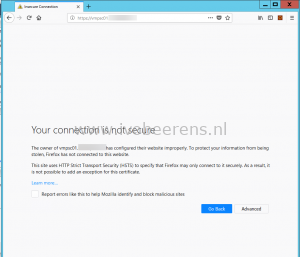
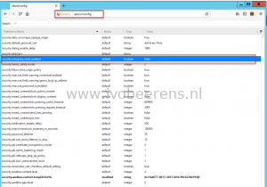
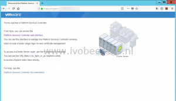

For a vCenter Server environment I replaced the default SSL certificates with CA signed SSL certificates. The Platform Service Controller (PSC) is configured as VMCA subordinate CA. When opening the vSphere Web/HTML5 Client, Firefox displays the following warning: *Your connection is not secure*.

This is because Firefox does not trust root certificates in the Windows certificate store. Since Firefox 49 a new option is included which allows Firefox to trust root certificates. This option is not enabled by default.

The following steps illustrate how to configure Firefox to use the Windows certificate store:

- Open Firefox
- In the address bar type: _about:config_
- Accept the warning
- Navigate to Preference name: _security.enterprise\_roots.enabled_ 
- Set the value to:  _true_

Firefox now trust the root certificates in the Windows certificate store.

