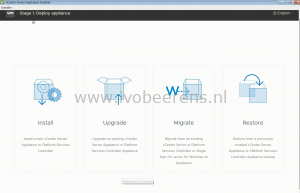
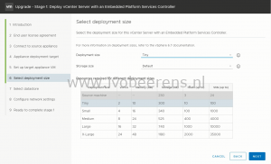
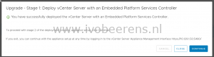

Last week VMware launched vSphere 6.7. In this blog post I show how easy it is to upgrade a vCenter Server 6.x appliance to a new vCenter Server 6.7 appliance using the graphical interface (GUI) upgrade. The GUI upgrade uses a two stage process:
- **Stage 1**: Deploy a new vCenter Server 6.7 appliance
- **Stage 2**: Transfer the services and configuration data from the old to the new appliance

Upgrading the vCenter Server Appliance includes deploying a new appliance (version 6.7). The configuration and data is transferred from old (6.0 or 6.5)  appliance to the new vCenter Server 6.7 Appliance.  The old appliance is still available in a powered down state in the vCenter Server inventory after the upgrade.

vSphere 6.7 is the last release to include vCenter Server for Windows. After this release, vCenter Server for Windows will not be available! So make sure that all new deployments and upgrades are using the the vCenter Server Appliance (VCSA)!

## New enhancements

Some cool enhancements of the vCenter Server 6.7 appliance are:

- The vCenter Server with Embedded PSC supports Enhanced Linked Mode. This gives the following benefits:
    - No load balancer required for high availability and fully supports native vCenter Server High Availability.
    - SSO Site boundary removal provides flexibility of placement.
    - Supports vSphere scale maximums.
    - Allows for 15 deployments in a vSphere Single Sign-On Domain.
    - Reduces the number of nodes to manage and maintain.
- vSphere 6.7 supports repointing a vCenter Server to another external Platform Services Controller in the same SSO site and different SSO site within the same SSO domain
- vSphere 6.7 supports repointing a vCenter Server (Appliance only) to another external Platform Services Controller in a different SSO domain.
- The vSphere Appliance Management Interface (VAMI) on port 5480 has some great new enhancements:
    - Upgraded Clarity interface
    - Dedicated monitor tab
    - Services tab. See the status of the VCSA services and the ability to: stop, start and restart services. So no CLI is needed for that anymore!
    - Backup scheduler. The backup scheduler let you schedule a backup of the VCSA and select how many backups are retained. The supported protocols for backup locations are: FTP, FTPS, HTTP, HTTPS and SCP.
- The vSphere Client (HTML5) has updated and includes new workflows on Update Manager and vSAN for example.

## Before upgrading

Before upgrading make sure to check this:

- Check the compatibility of the VMware and third party products you are using. When writing this blog the following VMware products are not compatible (yet) with vSphere 6.7:
    - NSX
    - Horizon. Horizon 7.4 is not compatible with the Instant Clone API used in vSphere 6.7. Instant Clone support for vSphere 6.7 will be available in an upcoming Horizon release.
    - VMware Integrated OpenStack (VIO)
    - VMware vSphere Integrated Containers (VIC)
    - vCloud Director
- For the upgrade order of multiple VMware products see the "Update sequence for vSphere 6.7 and its compatible VMware products (53710)" KB, [link](https://kb.VMware.com/s/article/53710?other.KM_Utility.getArticleLanguage=1&r=1&other.KM_Utility.getArticleData=1&other.KM_Utility.getArticle=1&ui-comm-runtime-components-aura-components-siteforce-qb.Quarterback.validateRoute=1&other.KM_Utility.getGUser=1)
- It's only possible to upgrade the vCenter Server Appliance version 6.0 or 6.5 to 6.7.
- **It's not supported to upgrade from 6.5 U2 to 6.7! It will be provided in a future release! With vSphere 6.7 Update 1 (not available yet) it's possible to upgrade from vSphere 6.5 U2 to vSphere 6.7 U1.**
- For vSphere 5.5 you must first upgrade to vSphere 6 or vSphere 6.5 before upgrading to vSphere 6.7
- Make sure you have enough capacity in the cluster to add an extra vCenter Server Appliance (VCSA). The old appliance can be removed when the upgrade is successful. Here's an overview of the hardware specifications needed.
- In vSphere 6.7, only TLS 1.2 is enabled by default. vSphere 6.7 disables TLS 1.0 and TLS 1.1 protocols for improved security. Some applications might support only the older protocols. To revert TLS 1.0 and TLS 1.1 protocols use the TLS reconfigurator tool. The tool can be found in the appliance under: /usr/lib/VMware-TlsReconfigurator/VcTisReconfigurator.
- Windows 2003 and XP are no longer supported.

**Platform Services Controller (PSC) hardware sizing**

<table><tbody><tr style="height: 24px;"><td style="height: 24px;">Option</td><td style="height: 24px;">Environment</td><td style="height: 24px;">vCPU</td><td style="height: 24px;">Memory (GB)</td><td style="height: 24px;">Default Storage (GB)</td></tr><tr><td>Platform Services Controller</td><td></td><td>2</td><td>4</td><td>60</td></tr></tbody></table>

**vCenter Server Appliance (VCSA) hardware sizing**

<table><tbody><tr><td>Option</td><td>Environment</td><td>vCPU</td><td>Memory (GB)</td><td>Default Storage (GB)</td></tr><tr><td>Tiny</td><td>Up to 10 hosts or 100 VMs</td><td>2</td><td>10</td><td>250</td></tr><tr><td>Small</td><td>Up to 100 hosts or 1000 VMs</td><td>4</td><td>16</td><td>290</td></tr><tr><td>Medium</td><td>Up to 400 hosts or 4000 VMs</td><td>8</td><td>24</td><td>425</td></tr><tr><td>Large</td><td>Up to 1000 hosts or 10000 VMs</td><td>16</td><td>32</td><td>640</td></tr><tr><td>X-Large</td><td>Up to 2000 hosts or 35000 VMs</td><td>24</td><td>48</td><td>980</td></tr></tbody></table>

- Use a temporary fixed IP address
- Make sure that you have the SSO administrator and root account information of the existing VCSA
- Have a backup of the VCSA
- Disable Fully Automated DRS during the upgrade

## The upgrade steps

In the following steps a single vCenter Server  Appliance with an embedded PSC and vCenter Server role will be upgraded to version 6.7:
- Mount the VCSA ISO (VMware-VCSA-all-6.7.0-8217866.iso)
- Navigate to the _<drive letter>:\\vcsa-ui-installer\\win32\\_ folder and open the _installer.exe_
- Choose for the _upgrade_ option. With the option you can upgrade a PSC and vCenter Server appliance.

- 1\. The upgrading process will enter "stage 1", deploy the appliance.

- 2\. Accept the End user License Agreement.

- 3\. Connect to the source vCenter Server 6.x appliance and ESXi server.  Enter the SSO and root username of the VCSA and the ESXi server that manages the source appliance. Accept the certificate warning.

- 4\. Select the deployment target. I use the same ESXi host where the source VCSA is running. Accept the certificate warning.

- 5\. Set up the target appliance VM name and root password. The upgrade will maintain the original FQDN name of the VCSA. This name will be used as VM name in the VCSA inventory and can be changed later!

- 6\. Select the (new) size of the new appliance.

- 7\. Select the datastore

- 8\. Configure the network settings. Make sure to use an new temporarily IP address for the upgrade. After the upgrade the new appliance will use the original IP address!

- 9\. Click finish to start stage 1

- After a while the following message appears and you're ready to continue to stage 2.

- 1\. Introduction. Stage 2 will copy data from the source vCenter Server Appliance to the new deployed appliance.

- 2\. A pre-upgrade check will run, after the pre-upgrade check has finished warning messages will be shown such as:
    - Disable Fully Automated DRS during the upgrade
    - Files that cannot be used with Update Manager 6.7 will not be copied from the source.
    - An NSX extension has been found that may not work after the upgrade

- 3\. The data types that needs to migrated can be selected. A new cool thing is that the amount of time that's involved is displayed for the Configuration data.

- 4\. Configure the VMware Customer Experience Improvement Program (CEIP)

- 5\. Ready to start fase 2 by selecting "I have backed up the source vCenter Server and all the required data from the database.

- A shutdown warning is displayed, the source VCSA will be shut down.

- The data transfer and appliance setup is running

- A couple of messages will be displayed about for example Auto Deploy and that TLS 1.0 and TLS 1.1 are disabled in vSphere 6.7.

- Stage 2 is completed and the vCenter Server Appliance is deployed.

- Now you can access the vCenter Server by using vSphere Client (HTML5), the vSphere Web Client or VMware Appliance Management Interface by using the original FQDN of the vCenter Server Appliance.

After the upgrade the VCSA is upgraded to version 6.7.