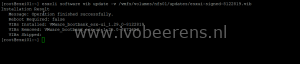
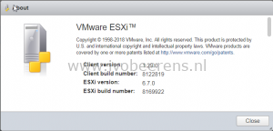
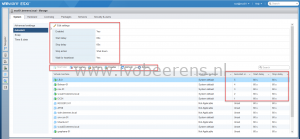
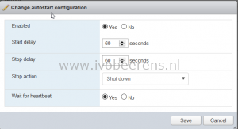
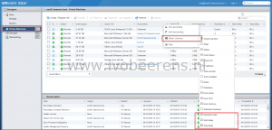
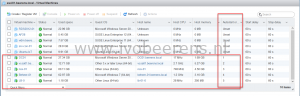

For a standalone ESXi host I manage the host with the ESXi Embedded Host Client (HTML client). So no vCenter Server is used to manage this host. The standalone ESXi host is 24×7 up and running and has some critical infrastructure VMs for my lab and home environment. The critical VMs are automatically powered-on when when the ESXi host is booted with the autostart option in the host client.

In the latest versions of the Host Client (In vSphere 6.7 version 1.25 is included that already contains the autostart improvements) the autostart configuration is greatly improved what result in an easier configuration of autostart. if you are on vSphere 6.0 or 6.5 I suggest to upgrade to the latest ESXi Embedded Host Client before configuring autostart.

The upgrade of the Host client is easy, no maintenance mode and reboot of the ESXi host is needed. The upgrade can be done by following these steps:

- Download the latest VIB for here, [link](https://labs.VMware.com/flings/esxi-embedded-host-client)
- Upload the VIB on a datastore on your ESXi host
- SSH to the ESXi host
- Enter the following command to update the host client

```
esxcli software vib update -v /vmfs/volumes/<datastore>/<vibname.vib>
```

[](images/update-host-client.png)

- Refesh the host client webpage `https://<esxihostname>/ui/`
- Check the version information in the host client **Help -> About**

[](images/versionnew.png)

Configure autostart in the ESXi Embedded Host Client

- Open the ESXi host client by using the following URL: `https://<esxihostname>/ui/`
- Go to: **Manage** -> **System** -> **Autostart->Edit Settings**
    - Enable: Yes
    - Start delay: 60 seconds
    - Stop delay: 60 seconds
    - Stop action: shut down
    - Wait for heartbeat: yes
    - **Save**

[](images/enable.png)

- Below the screen are the VMs listed. First enable autostart per VM by using the "Enable  autostart for this VM" button.
- Once the autostart is enabled per VM, the order can be configured by increase or decrease the start order. The autostart order is displayed in the "autostart order" field.
- Configure the autostart and order for the VMs you want to automatically start when the ESXi server is booted.
- Reboot the ESXi host to test the autostart

With older versions of the ESXi Embedded Host Client it is "more complicated" to set the start order per VM. To set the autostart order with older versions:

- Enable autostart as described above

[](images/1.png)

- In the Virtual Machines section, right click on the  field row and "Select columns". Select the following columns:
    - Autostart order
    - Start delay
    - Stop delay

[](images/2.png)

- Right click on the VM with the "Autostart order" status on Unset and select "increase" to enable autostart and set the order

[](images/3.png)

- Configure the autostart and order for the VMs you want to automatically start when the ESXi server is booted.
- Reboot the ESXi host to test the autostart