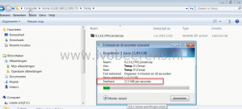
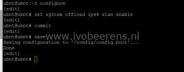
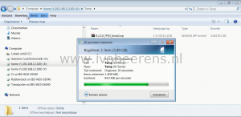

After putting my NAS in a separate storage VLAN I noticed that my network throughput was slow to and from the NAS. The throughput of a simple file copy from a windows laptop (wired at 1 GbE) to a SMB share on the NAS was only 17,7 MB. The Windows laptop was on a different VLAN then the NAS.

[](images/1.png)

After some troubleshooting I noticed that the throughput within the VLAN was okay  (120 MB/s on a 1 GbE network). The routing between the VLANs is done by Ubiquiti EdgeRouter Lite. I investigated the Ubiquiti EdgeRouter settings by using SSH and noticed that VLAN forwarding for IPv4 was disabled by using the following command:

```
ubnt@ubnt:~$ show ubnt offload
 
IP offload module : loaded
IPv4
forwarding: enabled
vlan : disabled
pppoe : disabled
gre : disabled
IPv6
forwarding: disabled
vlan : disabled
pppoe : disabled
 
IPSec offload module: loaded
 
Traffic Analysis :
export : disabled
dpi : disabled
version : 1.354
```

The following commands enable VLAN forwarding for IPv4 and save the setting:

```
ubnt@ubnt:~$ configure
[edit]
ubnt@ubnt:# set system offload ipv4 vlan enable
[edit]
ubnt@ubnt: commit
[edit]
ubnt@ubnt:# save
Saving configuration to '/config/config.boot' ...
Done
[edit]
```

[](images/2.png)

This config change can be done without a reboot of the router. After making this change the network throughput was as expected. So make sure to do some tests and check VLAN offloading in the Ubiquiti EdgeRouter (it's default disabled).

[](images/3.png)