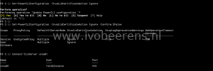

When trying to connect with PowerCLI to a vCenter Server Appliance the following error occurred:

[](images/powerclo.png)

> Connect-vIServer : 18-7-2018 13:20:10 Connect-VIServer Error: Invalid server certificate. Use Set-PowerCLIConfiguration to set the value for the InvalidCertificateAction option to Prompt if you'd like to connect once or to add a permanent exception for this server.

As stated in the error, the Set-PowerCLIConfiguration command can be used to ignore the certificate check using the following syntax:

```powershell  
Set-PowerCLIConfiguration -InvalidCertificateAction Ignore -Confirm:$false  
```

After this command you're able to connect to the vCenter without the certificate error.

[](images/2.png)