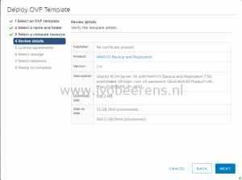

In this part of the NAKIVO Backup & Replication review I highlight the installation and basic configuration.

For the installation of NAKIVO Backup & Replication you have several options. NAKIVO Backup & Replication can be installed as
- Windows or Linux installation package
- Virtual Appliance for VMware (OVF)
- In the Amazon AWS cloud
- Directly installed on NAS devices such as QNAP, Synology and NETGEAR

In my test environment I installed NAKIVO Backup & Replication as Virtual Appliance (VA) on my VMware vSphere 6.7 environment. This is the latest available version of VMware vSphere when writing this blog. The installation of the virtual appliance can be deployed using the vSphere Client (HTML5) or the vSphere Web Interface.

After specifying the name, ESXi host/cluster, storage and selecting the right network, the VA is ready to be deployed. The appliance uses the following resources as VM:

<table style="border-collapse: collapse; width: 100%;" border="1"><tbody><tr><td style="width: 50%;">OS</td><td style="width: 50%;">Ubuntu Linux (64-bit) Virtual Appliance</td></tr><tr><td style="width: 50%;">CPU</td><td style="width: 50%;">2 vCPU</td></tr><tr><td style="width: 50%;">Memory</td><td style="width: 50%;">4 GB</td></tr><tr><td style="width: 50%;">Hard Disk 1</td><td style="width: 50%;">30 GB</td></tr><tr><td style="width: 50%;">Hard Disk 2</td><td style="width: 50%;">520 GB (repository)</td></tr><tr><td style="width: 50%;">Network Adapter</td><td style="width: 50%;">1</td></tr></tbody></table>

After the deployment the appliance is ready to start. In the console of the Virtual Appliance several settings can be adjusted such as: networking, security (SSH and root password), time and services using a menu interface.

The next step is the basic configuration.

**Network Attached Storage (NAS) Support**

Another test i did is to install NAKIVO Backup & Replication directly on my QNAP NAS. The installation is straight forward. Download the NAKIVO QNAP package and install this using QNAP AppCenter. After the installation you're ready to perform the basic configuration.

**Basic config**

After the installation is complete, you can log into NAKIVO Backup & Replication by opening the following URL:

https://<IP\_address\_of\_QNAP\_NAS>:4443

The fist time create an user and you're able to log in. In a three step wizard the following is configured:

- **Inventory**: On what virtual/cloud environment are my VMs running (VMware, Hyper-V or AWS)?
- **Transporter**: That's the component that performs the actual backup, replication and recovery as well the data compression, deduplication and encryption of the data.
- **Repository**: Where will the data stored.

**Inventory**

Because I have a VMware vSphere environment, I connect to an ESXi or vCenter Server in the inventory tab.

  

**Transporter**

The Virtual Appliance acts as transporter. The maximum load is default 6 concurrent tasks. It's always possible to add extra transporters when needed.

**Repository**

For the repository I use the onboard repository (uses hard disk 2) that is attached to the Virtual Appliance. The onboard repository compression and deduplication is configured by default.

Other repositories options are: CIFS, NFS and Amazon EBS.

**Updating**

When new updates are available they are displayed in the web interface.

 

For the Virtual Appliance (VA) download the updated installer and upload it the VA (/opt/nakivo/updates) folder. Open the console of the VA and select "Software Update" in the menu. It would be great when the upgrade process of the VA can be automated without any manually actions in feature releases.

This was the last step of the 3 step wizard. After approximately 15 minutes i'm ready with the installation and basic configuration of the Virtual Appliance.  I can conclude the following after the installation and basic configuration of NAKIVO Backup & Replication test:

- The installation of the Virtual Appliance and NAS option are simple and can be deployed very fast (minutes) without the need of a extra Windows licensing costs.
- When installing NAKIVO Backup & Replication on a NAS device. There is no need for VM resources or physical hosts which saves money
- Management via done by Web Browser, no software installation is needed