In this part of the NAKIVO Backup & Replication review the backup and recovery options will be highlighted.

## **Backup**

To begin with backup and recovery we first need a backup job. Configuring a backup job contains the following five steps:

- **1\. VMs**: Select the VMs to backup from the inventory of the vCenter Server or ESXi host.

[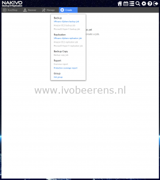](images/1-2.png) [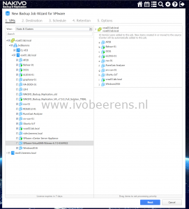](images/2-3.png)

- **2\. Destination**: Select the destination to store the VMs. Select the onboard repository with deduplication and compression enabled for storage space savings.

[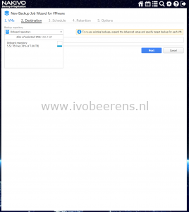](images/3-1.png)

- **3\. Schedule**: Create one or more backup schedules

[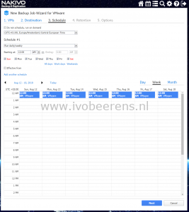](images/4.png)

- **4\. Retention**: Define the retention period for each Virtual Machine (VM). Each VM will have one or more recovery points were individual files, application object or the the entire VM can be recovered. A Grandfather-Father-Son (GFS) backup rotation scheme can be used.

[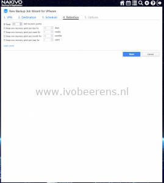](images/5.png)

- **5\. Options**: Select the options for the backup job:
    - **_App-aware mode_**: Use this option for applications that require that the data is consistent such as Microsoft SQL and Exchange.
    - **_Change tracking_**: Only the blocks that are changed since the last backup will be backup ed. This will increase the backup speed.
    - **_Screenshot verification_**: After the backup of each VM it will be recovered (with the network disconnected) and a screenshot will be made after the OS is started. The screenshot will be included in the email notification or in the job report.
    - _**Email notifications**_: When the job completes the status is send by Email.
    - **_Transport Mode_**: Hot Add, SAN, LAN or automatic can be selected
    - **_Bandwith throttling:_** With bandwidth throttling you can control the amount of bandwidth that is consumed by NAKIVO Backup and Replication.

[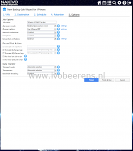](images/6-1.png) [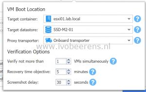](images/7-1.png) [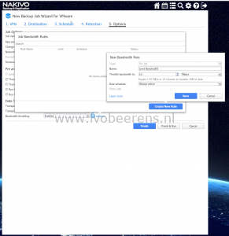](images/8-1.png)

The are more options to configure, refer to the following [link](https://helpcenter.nakivo.com/display/NH/Backup+Job+Wizard+for+VMware%3A+Options+Step) for all the options to configure.

In 5 easy wizzard based steps a backup job is be configured.

### **Reports**

There are several reporting functions available such as:

- **Last run report.**  Provides the status of the last run backup.
- **Point-in-time report.** Provides data on a particular job run.
- **Job history report.** Provides data on job runs that occurred during a specified time period.
- **Protection coverage report.** Contains information about all VMs and instances protected by backup and/or replication jobs, as well as about all unprotected VMs and instances.

The "last run" report is includes information about the backup such as:

- Summary
- Virtual Machines
- Target Storage
- Alarms & Notifications

This report can be created manually or in the backup job you can specify the email address of one or more recipient(s) were the report will be send to.

[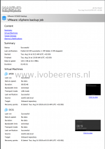](images/report-1.png)

When screenshot verification is used, the screenshot is also included in the report.

## **Restore / Recover**

**Appliance backup**

The configuration of the NAKIVO Backup & Replication server /appliance can be secured by using the Self-backup feature. When something happen with the NAKIVO Backup & Replication server the configuration can be quickly restored on another server.

[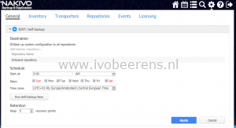](images/1-7.png)

After the first backup job is finished there a multiple ways to recover VM data. The following options are available to recover data from the backups:

- **Individual files**. You can recover files or folders directly from compressed and deduplicated repository.
- **Microsoft SQL Server objects.** Enables browsing, searching, and recovering Microsoft SQL Server objects.
- **Microsoft Active Directory objects. E**nables browsing, searching, and recovering Microsoft Active Directory objects**.**
- **Microsoft Exchange objects**. Enables browsing, searching, and recovering Microsoft Exchange emails.
- **Export Backups**. This is called "**Cross-Platform Recovery"** and will be handled in the next paragraph.
- **Flash VM boot**. Enables to run VMware and Hyper-V VMs directly from repository without the need to recover the VMs first.
- **VM recovery from backup**. Full VM recovery. When you recover a VM, a new VM is created and the "old" VM is retained.

[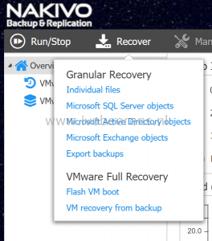](images/2-4.png)

I tested several recover options:

- **Individual files.** Individual files per VM can be restored. The files can be recovered on a server (for example on the same location as deleted), downloaded to the browser or emailed. I tested to recover two PowerShell files from a VM and selected the download to browser option. The files recovery is performed in seconds.

[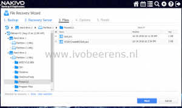](images/2-7.png) [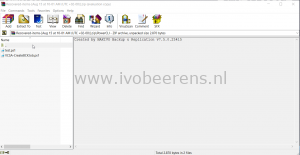](images/3-3.png)

- **VM recovery from backup**. With this option one or more full VMs are recovered.  The original VM will be retained so the recovering VM will not overwrite the original VM.  The recovering VM name will append "-recovered" in the end. The recovery is fast.

[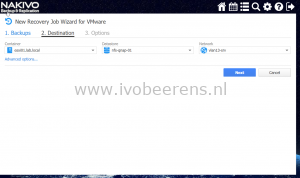](images/1-5.png)[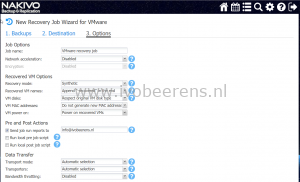](images/2-8.png) [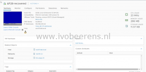](images/4-1.png)

- **VM Flash boot.** With the VM Flash boot option it's possible to boot VMs directly from the compressed and deduplicated repository without recovering the VMs first. This saves time and can be used for example for testing software updates. VM Flash boot uses iSCSI technology to connect VM disks stored in the backup to a target to the ESXi host. In this test I recovered two VMs in isolated network and performed a software update for testing. The changes are not written to the recovery point that i'm using. When i'm finished with testing i can discard the VMs with a single click so that all the changes are lost.

[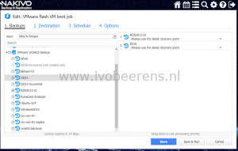](images/1-8.png) [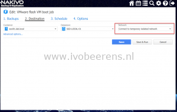](images/2-9.png) [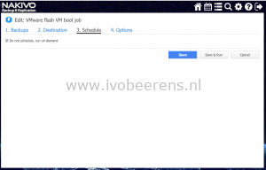](images/3-4.png) [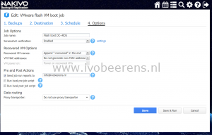](images/4-3.png)

- **Cross-Platform Recovery.** Cross-Platform Recovery allows exporting virtual disks to other formats such as:
    - VMDKs for VMware
    - VHD for Hyper-V
    - VDHX for Hyper-V

This allows you to recover VMs in different environments (VMware to Hyper-V and Hyper-V to VMware). In this testI exported a VMware Virtual Machine with two VMDK disks to VHDX disks with the Backup Export Wizard. The "Export backups" wizzard is used and by selecting the VM and recovery point, disks and options to start the export job.

[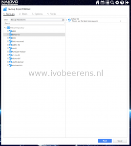](images/1-4.png) [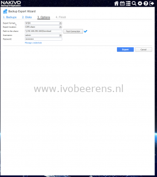](images/3-2.png) [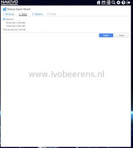](images/2-5.png)

When the export completed, I created a new VM in Hyper-V Manager and pointed to the restored VDHX disks. Then i was able to start a Hyper-V VM with the exported disks attached. Cross-Platform Recovery can be used for recover VM disks from between hypervisor such as VMware vSphere to Hyper-V and to VMware Workstation and VirtualBox.

[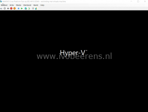](images/1-6.png)

In this part of the NAKIVO Backup & Replication review I highlighted the backup and recovery features. It was a pleasure to test the backup and recovery features because they were easy, quick and they worked out of the box without any troubleshooting skills needed. In the next review I will highlight the replication feature.